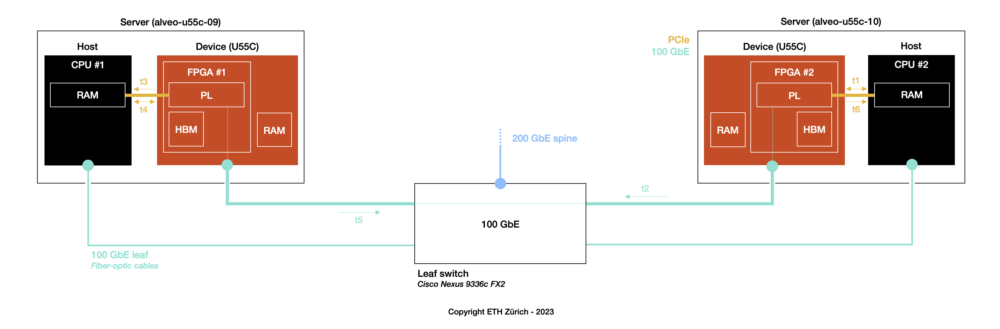

<div id="readme" class="Box-body readme blob js-code-block-container">
<article class="markdown-body entry-content p-3 p-md-6" itemprop="text">
<p align="right">
<a href="https://github.com/fpgasystems/sgrt/blob/main/examples.md#examples">Back to examples</a>
</p>

In this experiment, we are using [`sgutil validate coyote`](../cli/manual/sgutil-validate-coyote.md#sgutil-validate-coyote) command to validate Coyote on ETHZ-HACC. You can validate three different Coyote shells: perf_host, perf_rdma_host, or gbm_dtrees.

## perf_rdma_host
1. Use the [booking system](https://alveo-booking.ethz.ch/login.php) to reserve two servers, for example, alveo-u55c-09 and alveo-u55c-10,
2. Login to the server you want to set as the local server; from such a server, make sure you can log into the remote server with ssh,
3. Run ```sgutil validate coyote,``` select **perf_rdma_host,** and wait for the results.


*Validating perf_rdma_host with sgutil validate coyote.*

## Results
In this experiment, we have reserved five servers (alveo-u55c-01 to alveo-u55c-05) where alveo-u55c-01 is the local instance connecting to the remotes. **Please, remember that** ```sgutil validate mpi``` **sets -n (the number of processes to use) to two.** This means that each remote server will execute two copies of the compiled *hello_world.c* MPI program—so the local server receives results from a total of eight processors:


*Validating perf_rdma_host with sgutil validate coyote.*