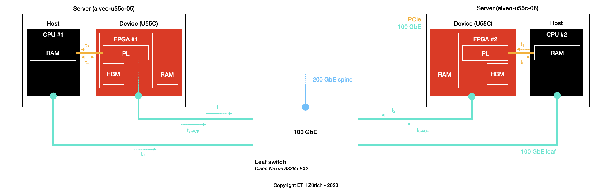

<div id="readme" class="Box-body readme blob js-code-block-container">
<article class="markdown-body entry-content p-3 p-md-6" itemprop="text">
<p align="right">
<a href="https://github.com/fpgasystems/sgrt/blob/main/examples.md#examples">Back to examples</a>
</p>

# RDMA stack validation

In this experiment, we utilize the [`sgutil validate coyote`](../cli/manual/sgutil-validate-coyote.md#sgutil-validate-coyote) command to validate Coyote’s RDMA stack on ETHZ-HACC. The validation test involves exchanging multiple messages (of various sizes), and for each message size, the following steps are performed:


*Validating perf_rdma_host with sgutil validate coyote.*

* **t0:** Bla bla bla
* **t1:** Bla bla bla
* **t2:** Bla bla bla
* **t3:** Bla bla bla
* **t4:** Bla bla bla
* **t5:** Bla bla bla
* **t6:** Bla bla bla

## Experiment
To validate the RDMA stack, please do as follows:

1. Use the [booking system](https://alveo-booking.ethz.ch/login.php) to reserve two servers, for example, alveo-u55c-05 and alveo-u55c-06,
2. Login to the server you want to set as the local server; from such a server, make sure you can log into the remote server with ssh,
3. Run ```sgutil validate coyote,``` select **perf_rdma_host,** and wait for the results.

## Results
In this experiment, we have allocated two servers (alveo-u55c-05 to alveo-u55c-06) to execute the steps described above. The subsequent results should serve as a baseline:


*Results for sgutil validate coyote / perf_rdma_host.*