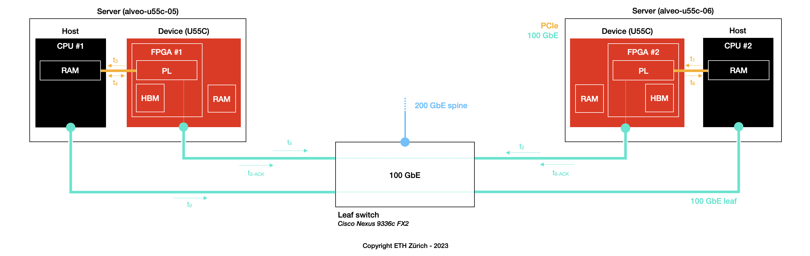
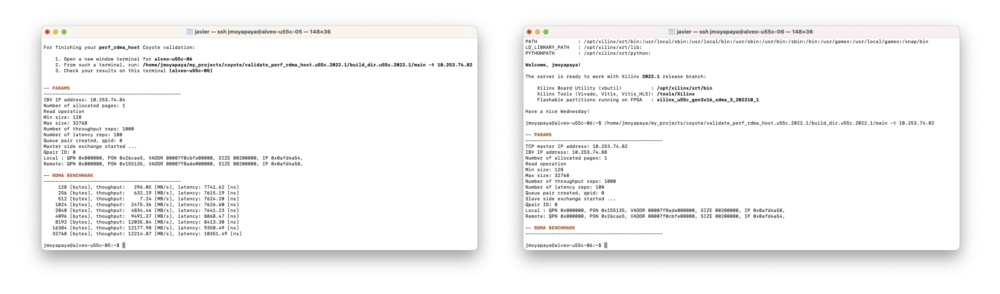

<div id="readme" class="Box-body readme blob js-code-block-container">
<article class="markdown-body entry-content p-3 p-md-6" itemprop="text">
<p align="right">
<a href="https://github.com/fpgasystems/sgrt/blob/main/hacc-validation.md#hacc-validation">Back to HACC validation</a>
</p>

## RDMA stack validation

In this experiment, the validation of Coyote’s RDMA stack on ETHZ-HACC is conducted using the [`sgutil validate coyote`](../cli/manual/sgutil-validate-coyote.md#sgutil-validate-coyote) command. The validation process comprises a series of back-and-forth memory exchanges involving messages of various sizes. For each message size, the following sequential steps are executed:


*Validating perf_rdma_host with sgutil validate coyote.*

 <!-- t1 ==== WHICH RAM, HBM ???????? -->

* **t0:** CPU #1 transmits metadata to CPU #2 via their respective Ethernet interfaces.
* **t1:** CPU #2 initiates an RDMA-write transaction, facilitating the transfer of data from CPU #2's global space to the memory of FPGA #2 through the PCIe interface.
* **t2:** FPGA #2 dispatches the RDMA-write message to FPGA #1 utilizing the Ethernet interfaces dedicated to the FPGAs.
* **t3:** FPGA #1 receives the data transfer and deposits it into CPU #1's host memory through the PCIe interface. Simultaneously, an RDMA-ACKnowledge (ACK) is transmitted back to FPGA #2 via the 100 GbE interface.
* **t4:** CPU #1 detects the altered memory content and initiates an RDMA-write, sending the same buffer content in the reverse direction toward CPU/FPGA #2. In this process, the buffer content is transferred to the RDMA stack on FPGA #1 via the PCIe link.
* **t5:** FPGA #1 transmits the RDMA-write message to FPGA #2 using the dedicated Ethernet interfaces similarly to t2.
* **t6:** FPGA #2 receives the RDMA-write, acknowledges it through the 100 GbE network to FPGA #1, and directly writes the received content into the host memory of CPU #2 via the PCIe link.

Though Coyote, these steps evaluate the reliability of Balboa RDMA-stack by handling various message sizes and intricate memory exchanges within the specified hardware environment.

### Experiment
To validate the RDMA stack, please do as follows:

1. Use the [booking system](https://alveo-booking.ethz.ch/login.php) to reserve two servers, for example, alveo-u55c-05 and alveo-u55c-06,
2. Login to the server you want to set as the local server; from such a server, make sure you can log into the remote server with ssh,
3. Run ```sgutil validate coyote,``` select **perf_rdma_host,** and wait for the results.

### Results
In this experiment, we have allocated two servers (alveo-u55c-05 to alveo-u55c-06) to execute the steps described above. The subsequent results should serve as a baseline:


*Results for sgutil validate coyote / perf_rdma_host.*