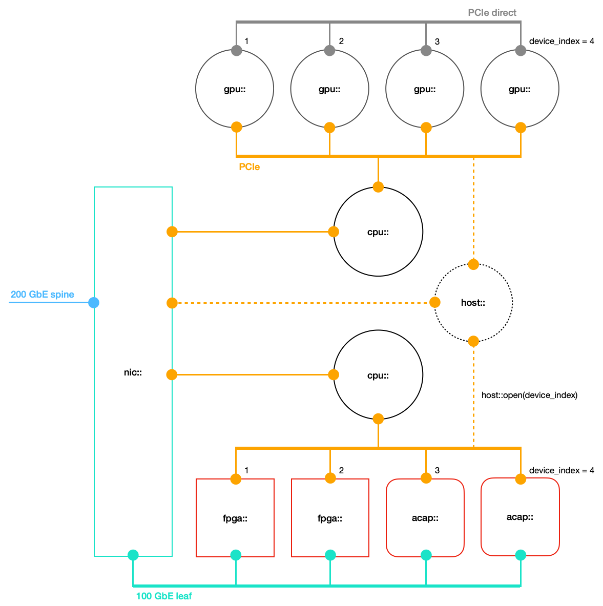

<article class="markdown-body entry-content p-3 p-md-6" itemprop="text">

<a href="https://github.com/fpgasystems/sgrt/tree/main#--systems-group-runtime">Back to top</a>

# Programming model

## Vitis workflow

*Programming model.*