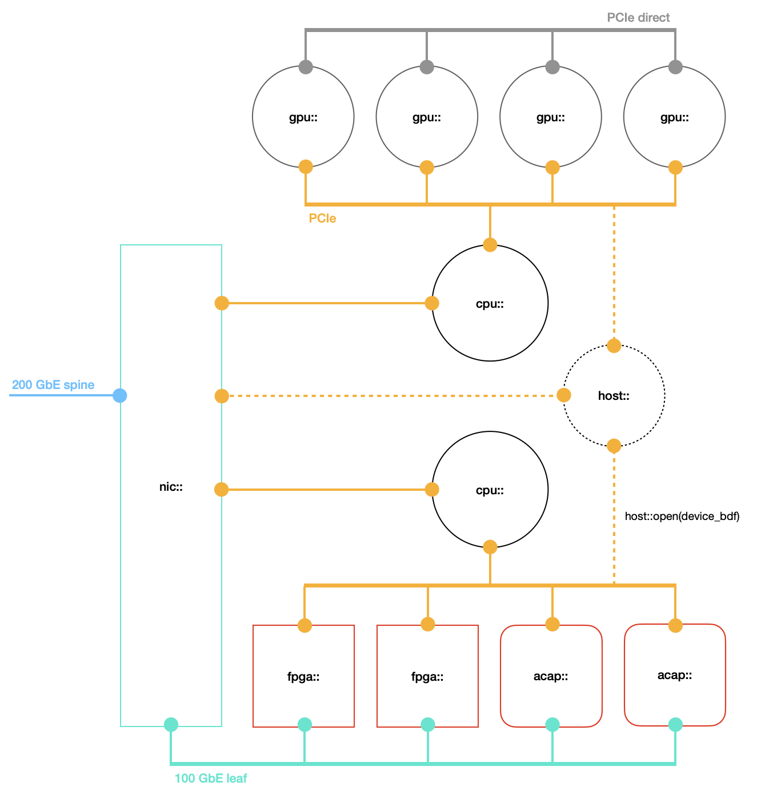

<div id="readme" class="Box-body readme blob js-code-block-container">
<article class="markdown-body entry-content p-3 p-md-6" itemprop="text">
<p align="right">
<a href="https://github.com/fpgasystems/sgrt/tree/main#--systems-group-runtime">Back to top</a>
</p>

# Programming model

SGRT allows you to effectively manage and program ACAPs, FPGAs, multi-core CPUs, and GPUs, all through a unified device index. To get to know which devices are available on your server, please use ```sgutil examine```:

 and hacc-box-01 (right).")
*sgutil examine for alveo-u55c-01 (left) and hacc-box-01 (right).*

Assuming an heterogeneous server with multiple reconfigurable devices like *hacc-box-01* on ETHZ-HACC: 


*HACC boxes architecture.*

**the following programming model applies:**


*Programming model.*