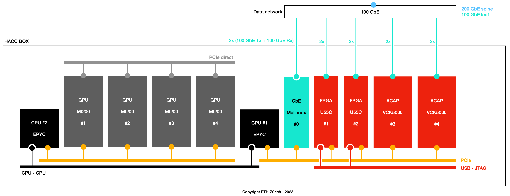

<div id="readme" class="Box-body readme blob js-code-block-container">
<article class="markdown-body entry-content p-3 p-md-6" itemprop="text">
<p align="right">
<a href="https://github.com/fpgasystems/sgrt/tree/main#--systems-group-runtime">Back to top</a>
</p>

# Programming model

SGRT enables effective management and programming of ACAPs, FPGAs, multi-core CPUs, and GPUs, **all through a unified device index.** To identify available devices on your server, please utilize ```sgutil examine```:

 and hacc-box-01 (right).")
*sgutil examine for alveo-u55c-01 (left) and hacc-box-01 (right).*

Assuming an heterogeneous server with multiple reconfigurable devices like *hacc-box-01* on ETHZ-HACC: 


*HACC boxes architecture.*

**the following programming model applies:**


*Programming model.*

In such a model, four GPUs and reconfigurable devices (ACAPs and FPGAs) are each assigned unique device indexes. Through the device index, users can effortlessly manage these devices using the CLI and expedite the creation of accelerated applications with the API.

 and API (right).")
*Managing and developing applications for reconfigurable devices using device indexes: utilizing the CLI (left) and API (right).*