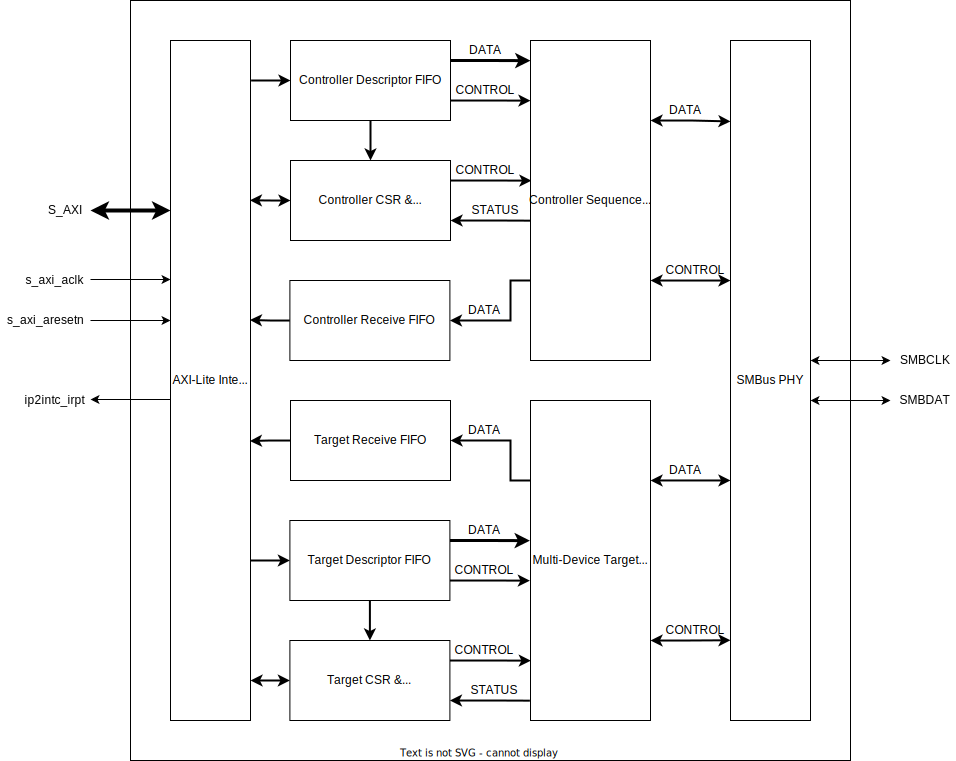

=============
SMBus IP v1.1
=============

Overview
========

The SMBus IP provides a mechanism through which a Versal ACAP based system may interact with 
external devices that are compliant to the `System Management Bus (SMBus) v3.2 Specification`_. 
SMBus is a two-wire open-drain interface based on the principles of operation defined by the `I2C 
Bus Specification`_. It provides a standardized control path that enables devices to pass system 
and power management related messages.

The SMBus IP is designed to be implemented within the PL region of a Versal ACAP and requires 
connection to I/O Buffers located within an appropriate HDIO bank, these IOBs must be configured to 
meet the electrical requirements outlined in the SMBus Specification. The IP implements an 
AXI4-Lite Subordinate memory mapped control interface to enable a processor to interact with other 
external SMBus devices, the IP supports operation as both a Controller and a multi-device Target to 
enable multiple management protocols to be implemented simultaneously.

.. _`System Management Bus (SMBus) v3.2 Specification`: http://smbus.org/specs/SMBus_3_2_20220112.pdf
.. _`I2C Bus Specification`: https://www.nxp.com/docs/en/user-guide/UM10204.pdf

Features
========

- Controller operation
- Target operation supporting up to 8 devices
- Support for 100KHz, 400KHz or 1MHz operation
- Packet Error Correction (PEC) Generation and Checking
- Loss of Arbitration detection as a Controller-transmitter
- Loss of Arbitration detection as a Target-transmitter
- Controller clock synchronization
- Controller clock stretching
- Target clock stretching
- Descriptor based event sequence control
- Interrupt driven operation
- SMBCLK low timeout detection
- SMBDAT low timeout detection
- SMBCLK/SMBDAT glitch suppression
- SMBCLK stretching timeout detection (Tlow:TEXT/CEXT)

Applications
============

The diagram below outlines a typical use case for the SMBus IP as deployed within a Versal based 
PCIe add-in accelerator card. The SMBus IP provides a mechanism for the card management software 
in conjunction with the SMBus IP Driver running on the RPU to communicate with the host server BMC.

Standards
=========

The SMBus IP when implemented in conjunction with the SMBus IP Driver is compliant to the System 
Management Bus Specification, version 3.2, January 2022 with the following exceptions:

- The Quick Command bus protocol is not supported by the SMBus IP for Target device operation.

Architecture Overview
=====================

The block diagram below gives a high level overview of the logical structure of the SMBus IP.

AXI4-Lite Interface
-------------------

The SMBus IP implements a 32-bit AXI4-Lite Subordinate interface that provides an external 
processor with memory mapped access to internal register space. The Descriptor/Receive FIFOs and 
control/status registers that are present within the IP are all accessed via this interface.

Controller Receive FIFO
-----------------------

The Controller Receive FIFO stores bytes that are received by the SMBus IP during Controller Read 
operations until the processor is ready to read and process theses bytes. The FIFO is arranged as 
8-bits x 64 and incorporates a processor programmable fill threshold interrupt that may be 
configured in order to regulate the rate at which the processor is notified about available data.

Controller Descriptor FIFO
--------------------------

The Controller Descriptor FIFO is used to store the sequence descriptors that are written via the 
processor interface until they can be executed by the Controller Sequence Control function. Each 
sequence descriptor instructs the IP to execute a portion of an SMBus packet and may be combined 
to form any of the Bus Protocols defined in the SMBus Specification.

Controller CSR and Interrupt Control
------------------------------------

The Controller Control and Status Registers (CSR) implements the internal control/status registers 
associated with the Controller Sequence Control function. Relevant semi-static control registers 
are configured in this function, whereas dynamic control is performed using the sequence 
descriptors. Interrupt configuration for the interrupt sources generated by the Controller 
Sequence Control function are also managed within this function.

Controller Sequence Control
---------------------------

The Controller Sequence Control function operates as an SMBus Controller and works in tandem with 
the SMBus PHY in order to generate the SMBus packet as directed in the received sequence 
descriptors. The primary functions performed within the Controller Sequence Control function 
includes:

- Reading the Controller Descriptor FIFO and processing the sequence descriptor
- Instructing the PHY on when to transmit START/REPEATED-START/STOP conditions on the SMBus
- Providing the PHY with transmit bytes during the Controller Write sequences
- Reading the assembled received bytes from the PHY during a Controller Read sequence and writing 
  into the Receive FIFO
- Performing PEC byte generation and insertion during Controller Write sequences
- Performing PEC byte integrity checking on received packets during Controller Read sequences
- Status interrupt generation based on events occurring during Read/Write sequences

Target Receive FIFO
-------------------

The Target Receive FIFO stores bytes that are received by the SMBus IP during Target Write 
operations until the processor is ready to read and process theses bytes. The FIFO is arranged as 
8-bits x 64 and incorporates a processor programmable fill threshold interrupt that may be 
configured in order to regulate the rate at which the processor is notified about available data.

Target Descriptor FIFO
----------------------

The Target Descriptor FIFO is used to store the sequence descriptors that are written via the 
processor interface until they can be executed by the Target Sequence Control function. Each 
sequence descriptor instructs the IP on how to respond during a Read or Write initiated by an 
external Controller.

Target CSR and Interrupt Control
--------------------------------

The Target Control and Status Registers (CSR) implements the internal control/status registers 
associated with the Target Sequence Control function. Relevant semi-static control registers are 
configured in this function, whereas dynamic control is performed using the sequence descriptors. 
Interrupt configuration for the interrupt sources generated by the Target Sequence Control 
function are also managed within this function.

Target Sequence Control
-----------------------

The Target Sequence Control function operates as a multi-device SMBus Target that supports 
operation as up to 8 different devices, each target device address is run time configurable by the 
processor via the AXI4-Lite interface. The primary functions performed within the Target Sequence 
Control function includes:

- Performing a comparison check on the address received by the PHY following a START condition, 
  against the configured target addresses of interest
- Reading the Target Descriptor FIFO and processing the sequence descriptor
- Instructing the PHY whether to ACK or NACK a receive byte during a Target Write sequence based 
  on the descriptor
- Writing received bytes from the PHY into the Receive FIFO
- Providing the PHY with transmit bytes during Target Read sequences based on the payload byte 
  contained in the sequence descriptor
- Performing PEC byte integrity checking on received packets during Target Write sequences
- Performing PEC byte generation and insertion during Target Read sequences
- Status interrupt generation based on events occurring during Read/Write sequences

SMBus PHY
---------

The SMBus PHY provides the physical layer interfacing to the SMBus when connected via Input/Output 
Buffers in an appropriately configured HDIO bank. The primary functions performed within the SMBus 
PHY includes:

- SMBCLK/SMBDAT input retiming onto the s_axi_aclk domain and noise suppression for glitches <50ns 
  period
- SMBCLK/SMBDAT input low timeout and bus idle detection
- SMBCLK/SMBDAT output/tri-state control
- SMBCLK output low force
- Tracking of SMBus state in conjunction with the Target Sequence Control function
- Performing SMBCLK clock stretching as a Target when awaiting instruction from the Target Sequence 
  Control function
- Transmission of ACK/NACK as a Target-transmitter in accordance with the SMBus AC Specifications
- Assembly of receive bytes during Target-receiver operation and forwarding to the Target Sequence 
  Control function for processing
- Transmission of read data bytes as a Target-transmitter in accordance with the SMBus AC 
  Specifications
- Loss of arbitration detection during Target-transmitter operation
- Clock generation and synchronization during Controller operation
- START/REPEATED-START/STOP condition transmission as a Controller-transmitter
- Transmission of write data bytes as a Controller-transmitter in accordance with the SMBus AC 
  Specifications
- Assembly of receive bytes during Controller-receiver operation and forwarding to the Controller 
  Sequence Control function for processing
- Loss of arbitration detection during Controller-transmitter operation
- Controller Tlow:TEXT timeout detection and Tlow:CEXT measurement
- Target Tlow:TEXT measurement

Sequence Descriptors
--------------------

The SMBus IP is primarily controlled using a set of descriptors, these descriptor sets are 
independent for both the Target and Controller f unctions, however the high level behavior is 
similar. A descriptor consists of a 4-bit ID that instructs the IP on what action to take on the 
SMBus, along with a payload byte that must be supplied when operating as a transmitter.

Descriptors must be written in the order in which they are to be executed via the AXI4-Lite 
processor interface to either the Target or Controller Descriptor FIFOs. When the SMBus IP is 
active for either Target or Controller operation, then it will read and process each descriptor at 
the appropriate time during either transmission or reception of a SMBus packet. While the IP waits 
for descriptors, it will perform smbclk clock stretching in order to back-pressure the SMBus until 
such time that software has determined the next steps and provided the next descriptor.

For scenarios where data on the SMBus must be processed on a byte by byte basis (e.g. Target ARP), 
then typically only a single descriptor would be supplied at any one time. The IP would execute the 
descriptor, notify any required response via interrupt, write received data into the Receive FIFO 
(if applicable) and then begin to clock stretch until software has processed the response and 
supplied another descriptor. 

In other scenarios the sequence of events is known in advance by software, for this the set of 
descriptors can be written to the Descriptor FIFOs and the IP will process each descriptor without 
performing any clock stretching. This approach attempts to minimize the amount of software 
involvement during packet transmission/reception and in turn reduces the amount of clock stretching 
necessary and the associated risk of exceeding the various clock low extension timeouts outlined in 
the SMBus Specification e.g. tTIMEOUT, tLOW:TEXT, tLOW:CEXT.

Resource Use
============

The table below contains resource utilization data for several configurations of the SMBus IP core. 
Each row within the table describes a test case. The columns are divided into test parameters and 
results. The test parameters include the part information and the core-specific configuration 
parameters. Any configuration parameters that are not listed have their default values; any 
parameters with a blank value are disabled or set automatically by the IP core.

- Resource figures are taken from the utilization report issued at the end of implementation using 
  the Out-of-Context flow in Vivado Design Suite.
- The Out-of-Context IP constraints include HD.CLK_SRC properties as required to ensure correct 
  hold timing closure: these properties are enabled using the Tcl command: 
  set_param ips.includeClockLocationConstraints true
- The frequencies used for clock inputs are stated for each test case.
- LUT figures do not include LUTs used as pack-thrus, but do include LUTs used as memory.
- Default Vivado Design Suite 2023.2 settings were used. You may be able to improve on these 
  figures using different settings. Because surrounding circuitry will affect placement and timing, 
  no guarantee can be given that these figures will be repeatable in a larger design.

.. csv-table:: SMBus IP Resource Usage
  :header: Vivado Release,Family,Device,Package,Speedgrade,Configuration Name,NUM_TARGET_DEVICES,SMBUS_DEV_CLASS,FREQ_HZ_AXI_ACLK,Fixed clocks,LUT,FF,DSP,RAMB36,RAMB18
  :widths: auto
  
  2023.2,versal,xcv80,lsva4737,2MHP,"config_0",8,0,95000000,s_axi_aclk=95,1411,16468,0,0,0
  2023.2,versal,xcv80,lsva4737,2MHP,"config_1",1,0,95000000,s_axi_aclk=95,1360,1605,0,0,0
  2023.2,versal,xcv80,lsva4737,2MHP,"config_2",8,0,500000000,s_axi_aclk=500,1659,1643,0,0,0
  2023.2,versal,xcv80,lsva4737,2MHP,"config_3",8,2,500000000,s_axi_aclk=500,1651,1645,0,0,0

Interface Descriptions
======================

.. list-table:: Interface Descriptions
  :header-rows: 1
  :widths: auto

  * - Interface
    - Signal
    - Direction
    - Range
    - Clock
    - Enablement Dependency
    - Description
  * - S_AXI
    - s_axi_araddr
    - Input
    - 11:0
    - s_axi_aclk
    - true
    - AXI4-Lite read address
  * - S_AXI
    - s_axi_arready
    - Output
    - scalar
    - s_axi_aclk
    - true
    - AXI4-Lite read address ready
  * - S_AXI
    - s_axi_arvalid
    - Input
    - scalar
    - s_axi_aclk
    - true
    - AXI4-Lite read address valid
  * - S_AXI
    - s_axi_awaddr
    - Input
    - 11:0
    - s_axi_aclk
    - true
    - AXI4-Lite write address
  * - S_AXI
    - s_axi_awready
    - Output
    - scalar
    - s_axi_aclk
    - true
    - AXI4-Lite write address ready
  * - S_AXI
    - s_axi_awvalid
    - Input
    - scalar
    - s_axi_aclk
    - true
    - AXI4-Lite write address valid
  * - S_AXI
    - s_axi_bready
    - Input
    - scalar
    - s_axi_aclk
    - true
    - AXI4-Lite write response ready
  * - S_AXI
    - s_axi_bresp
    - Output
    - 1:0
    - s_axi_aclk
    - true
    - AXI4-Lite write response
  * - S_AXI
    - s_axi_bvalid
    - Output
    - scalar
    - s_axi_aclk
    - true
    - AXI4-Lite write response valid
  * - S_AXI
    - s_axi_rdata
    - Output
    - 31:0
    - s_axi_aclk
    - true
    - AXI4-Lite read data
  * - S_AXI
    - s_axi_rready
    - Input
    - scalar
    - s_axi_aclk
    - true
    - AXI4-Lite read ready
  * - S_AXI
    - s_axi_rresp
    - Output
    - 1:0
    - s_axi_aclk
    - true
    - AXI4-Lite read response
  * - S_AXI
    - s_axi_rvalid
    - Output
    - scalar
    - s_axi_aclk
    - true
    - AXI4-Lite read valid
  * - S_AXI
    - s_axi_wdata
    - Input
    - 31:0
    - s_axi_aclk
    - true
    - AXI4-Lite write data
  * - S_AXI
    - s_axi_wready
    - Output
    - scalar
    - s_axi_aclk
    - true
    - AXI4-Lite write data ready
  * - S_AXI
    - s_axi_wstrb
    - Input
    - 3:0
    - s_axi_aclk
    - true
    - AXI4-Lite write strobes
  * - S_AXI
    - s_axi_wvalid
    - Input
    - scalar
    - s_axi_aclk
    - true
    - AXI4-Lite write data valid
  * - s_axi_aclk
    - s_axi_aclk
    - Input
    - scalar
    - 
    - true
    - Clock associated with the S_AXI interface
  * - s_axi_aresetn
    - s_axi_aresetn
    - Input
    - scalar
    - s_axi_aclk
    - true
    - Active-Low reset associated with the S_AXI interface
  * - ip2intc_irpt
    - ip2intc_irpt
    - Output
    - scalar
    - s_axi_aclk
    - true
    - Level High Interrupt
  * - SMBUS
    - smbclk_i
    - Input
    - scalar
    - Asynchronous
    - true
    - SMBus clock input
  * - SMBUS
    - smbclk_o
    - Output
    - scalar
    - s_axi_aclk
    - true
    - SMBus clock output
  * - SMBUS
    - smbclk_t
    - Output
    - scalar
    - s_axi_aclk
    - true
    - SMBus clock output tri-state control
  * - SMBUS
    - smbdat_i
    - Input
    - scalar
    - Asynchronous
    - true
    - SMBus data input
  * - SMBUS
    - smbdat_o
    - Output
    - scalar
    - s_axi_aclk
    - true
    - SMBus data output
  * - SMBUS
    - smbdat_t
    - Output
    - scalar
    - s_axi_aclk
    - true
    - SMBus data output tri-state control

Clocking
========

The SMBus IP operates on the s_axi_aclk clock domain, the smbclk_i/smbdat_i asynchronous inputs are 
retimed onto this clock domain internal to the IP.

The table below outlines the clock frequency ranges supported by the IP.

.. list-table:: Clock Support
  :header-rows: 1
  :widths: auto

  * - Clock Domain
    - Min (MHz)
    - Max (MHz)
    - Description
  * - s_axi_aclk
    - 95
    - 500
    - Clock used for S_AXI interface and internal core operation.

Resets
======

The SMBus IP is reset on assertion of the s_axi_aresetn active low reset input, this input must be 
synchronous to the s_axi_aclk.

When this reset is asserted, all internal registers are reset to their default values and the 
Target/Controller logic is brought back to an idle state. Any active SMBus transactions in progress 
by the IP are aborted.

Interrupts
==========

The SMBus IP operation is interrupt driven so that control information written via the processor 
interface is sufficiently responsive in order to comply with the timeout limits specified in the 
SMBus Specification.  

Refer to IRQ_IER/IRQ_ISR registers detailed in the Register Space section for information on the 
SMBus IP interrupt sources.

Register Space
==============

The table below outlines the layout and descriptions for the memory mapped register space within 
the SMBus IP, these registers are accessible via the AXI4-Lite interface.

Undocumented bits within registers are reserved and are Read-Only.

.. list-table:: S_AXI Register Space
  :header-rows: 1
  :widths: auto
  
  * - Register Address Offset
    - Register Name
    - Field Name
    - Bit Index
    - Default Value
    - Attribute
    - Field Description
  * - 0x000
    - IP_VERSION
    - MAJOR_VERSION
    - 31:16
    - 1
    - RO
    - | IP Major Version
      | Returns the IP Major Version
  * - 0x000
    - IP_VERSION
    - MINOR_VERSION
    - 15:0
    - 0
    - RO
    - | IP Minor Version
      | Returns the IP Minor Version
  * - 0x004
    - IP_REVISION
    - CORE_REVISION
    - 15:0
    - 0
    - RO
    - | IP Core Revision
      | Returns the IP Core Revision
  * - 0x008
    - IP_MAGIC_NUM
    - MAGIC_NUMBER
    - 31:0
    - 0x534D4273
    - RO
    - | IP Magic Number
      | Returns a read-only identifier to assist with debug/bring-up.
  * - 0x00C
    - IP_BUILD_CONFIG_0
    - FREQ_HZ_AXI_ACLK
    - 31:0
    - (Note 1)
    - RO
    - | Input AXI ACLK Frequency
      | Returns the value of the FREQ_HZ_AXI_ACLK parameter as configured at build time.
  * - 0x010
    - IP_BUILD_CONFIG_1
    - NUM_TARGET_DEVICES
    - 7:4
    - (Note 1)
    - RO
    - | Number of Target Devices supported
      | Returns the value of the NUM_TARGET_DEVICES parameter as configured at build time.
  * - 0x010
    - IP_BUILD_CONFIG_1
    - SMBUS_DEV_CLASS
    - 1:0
    - (Note 1)
    - RO
    - | Default SMBus Device Class
      | Returns the value of the SMBUS_DEV_CLASS parameter as configured at build time.
  * - 0x020
    - IRQ_GIE
    - ENABLE
    - 0:0
    - 0
    - RW
    - | Global Interrupt Enable
      | When set, interrupts enabled in the IRQ_IER register can assert the ip2intc_irpt interrupt output.
      | 0x0 - Disable the interrupt output
      | 0x1 - Enable the interrupt output
  * - 0x024
    - IRQ_IER
    - CTLR_DESC_FIFO_ALMOST_EMPTY
    - 15:15
    - 0
    - RW
    - | Controller Descriptor FIFO Almost Empty Interrupt Enable
      | When set, an interrupt will be generated when the IRQ_ISR register reports the CTLR_DESC_FIFO_ALMOST_EMPTY field as set.
      | 0x0 - CTLR_DESC_FIFO_ALMOST_EMPTY interrupt disabled
      | 0x1 - CTLR_DESC_FIFO_ALMOST_EMPTY interrupt enabled
  * - 0x024
    - IRQ_IER
    - CTLR_RX_FIFO_FILL_THRESHOLD
    - 14:14
    - 0
    - RW
    - | Controller Receive FIFO Fill Threshold Interrupt Enable
      | When set, an interrupt will be generated when the IRQ_ISR register reports the CTLR_RX_FIFO_FILL_THRESHOLD field as set.
      | 0x0 - CTLR_RX_FIFO_FILL_THRESHOLD interrupt disabled
      | 0x1 - CTLR_RX_FIFO_FILL_THRESHOLD interrupt enabled
  * - 0x024
    - IRQ_IER
    - CTLR_DESC_FIFO_EMPTY
    - 13:13
    - 0
    - RW
    - | Controller Descriptor FIFO Empty Interrupt Enable
      | When set, an interrupt will be generated when the IRQ_ISR register reports the CTLR_DESC_FIFO_EMPTY field as set.
      | 0x0 - CTLR_DESC_FIFO_EMPTY interrupt disabled
      | 0x1 - CTLR_DESC_FIFO_EMPTY interrupt enabled
  * - 0x024
    - IRQ_IER
    - CTLR_DONE
    - 12:12
    - 0
    - RW
    - | Controller Done Interrupt Enable
      | When set, an interrupt will be generated when the IRQ_ISR register reports the CTLR_DONE field as set.
      | 0x0 - CTLR_DONE interrupt disabled
      | 0x1 - CTLR_DONE interrupt enabled
  * - 0x024
    - IRQ_IER
    - CTLR_PEC_ERROR
    - 11:11
    - 0
    - RW
    - | Controller PEC Error Interrupt Enable
      | When set, an interrupt will be generated when the IRQ_ISR register reports the CTLR_PEC_ERROR field as set.
      | 0x0 - CTLR_PEC_ERROR interrupt disabled
      | 0x1 - CTLR_PEC_ERROR interrupt enabled
  * - 0x024
    - IRQ_IER
    - CTLR_NACK_ERROR
    - 10:10
    - 0
    - RW
    - | Controller NACK Error Interrupt Enable
      | When set, an interrupt will be generated when the IRQ_ISR register reports the CTLR_NACK_ERROR field as set.
      | 0x0 - CTLR_NACK_ERROR interrupt disabled
      | 0x1 - CTLR_NACK_ERROR interrupt enabled
  * - 0x024
    - IRQ_IER
    - CTLR_LOA
    - 9:9
    - 0
    - RW
    - | Controller Loss of Arbitration Interrupt Enable
      | When set, an interrupt will be generated when the IRQ_ISR register reports the CTLR_LOA field as set.
      | 0x0 - CTLR_LOA interrupt disabled
      | 0x1 - CTLR_LOA interrupt enabled
  * - 0x024
    - IRQ_IER
    - TGT_DESC_FIFO_ALMOST_EMPTY
    - 8:8
    - 0
    - RW
    - | Target Descriptor FIFO Almost Empty Interrupt Enable
      | When set, an interrupt will be generated when the IRQ_ISR register reports the TGT_DESC_FIFO_ALMOST_EMPTY field as set.
      | 0x0 - TGT_DESC_FIFO_ALMOST_EMPTY interrupt disabled
      | 0x1 - TGT_DESC_FIFO_ALMOST_EMPTY interrupt enabled
  * - 0x024
    - IRQ_IER
    - TGT_WRITE
    - 7:7
    - 0
    - RW
    - | Target Write Interrupt Enable
      | When set, an interrupt will be generated when the IRQ_ISR register reports the TGT_WRITE field as set.
      | 0x0 - TGT_WRITE interrupt disabled
      | 0x1 - TGT_WRITE interrupt enabled
  * - 0x024
    - IRQ_IER
    - TGT_READ
    - 6:6
    - 0
    - RW
    - | Target Read Interrupt Enable
      | When set, an interrupt will be generated when the IRQ_ISR register reports the TGT_READ field as set.
      | 0x0 - TGT_READ interrupt disabled
      | 0x1 - TGT_READ interrupt enabled
  * - 0x024
    - IRQ_IER
    - TGT_RX_FIFO_FILL_THRESHOLD
    - 5:5
    - 0
    - RW
    - | Target Receive FIFO Fill Threshold Interrupt Enable
      | When set, an interrupt will be generated when the IRQ_ISR register reports the TGT_RX_FIFO_FILL_THRESHOLD field as set.
      | 0x0 - TGT_RX_FIFO_FILL_THRESHOLD interrupt disabled
      | 0x1 - TGT_RX_FIFO_FILL_THRESHOLD interrupt enabled
  * - 0x024
    - IRQ_IER
    - TGT_DESC_FIFO_EMPTY
    - 4:4
    - 0
    - RW
    - | Target Descriptor FIFO Empty Interrupt Enable
      | When set, an interrupt will be generated when the IRQ_ISR register reports the TGT_DESC_FIFO_EMPTY field as set.
      | 0x0 - TGT_DESC_FIFO_EMPTY interrupt disabled
      | 0x1 - TGT_DESC_FIFO_EMPTY interrupt enabled
  * - 0x024
    - IRQ_IER
    - TGT_DONE
    - 3:3
    - 0
    - RW
    - | Target Done Interrupt Enable
      | When set, an interrupt will be generated when the IRQ_ISR register reports the TGT_DONE field as set.
      | 0x0 - TGT_DONE interrupt disabled
      | 0x1 - TGT_DONE interrupt enabled
  * - 0x024
    - IRQ_IER
    - TGT_PEC_ERROR
    - 2:2
    - 0
    - RW
    - | Target PEC Error Interrupt Enable
      | When set, an interrupt will be generated when the IRQ_ISR register reports the TGT_PEC_ERROR field as set.
      | 0x0 - TGT_PEC_ERROR interrupt disabled
      | 0x1 - TGT_PEC_ERROR interrupt enabled
  * - 0x024
    - IRQ_IER
    - TGT_LOA
    - 1:1
    - 0
    - RW
    - | Target Loss of Arbitration Interrupt Enable
      | When set, an interrupt will be generated when the IRQ_ISR register reports the TGT_LOA field as set.
      | 0x0 - TGT_LOA interrupt disabled
      | 0x1 - TGT_LOA interrupt enabled
  * - 0x024
    - IRQ_IER
    - ERROR_IRQ
    - 0:0
    - 0
    - RW
    - | Error Interrupt Enable
      | When set, an interrupt will be generated when the IRQ_ISR register reports the ERROR_IRQ field as set.
      | 0x0 - ERROR_IRQ interrupt disabled
      | 0x1 - ERROR_IRQ interrupt enabled
  * - 0x028
    - IRQ_ISR
    - CTLR_DESC_FIFO_ALMOST_EMPTY
    - 15:15
    - 0
    - W1C
    - | Controller Descriptor FIFO Almost Empty Interrupt Status
      | Set when the Controller has detected only one descriptor in the Descriptor FIFO and a transaction is in progress.
      | 0x0 - Controller Descriptor FIFO contains more than one descriptor or no transaction in progress
      | 0x1 - Controller Descriptor FIFO only contains one descriptor and a transaction is in progress
  * - 0x028
    - IRQ_ISR
    - CTLR_RX_FIFO_FILL_THRESHOLD
    - 14:14
    - 0
    - W1C
    - | Controller Receive FIFO Fill Threshold Interrupt Status
      | Set when the Controller Receive FIFO has reached the fill level configured in the CTLR_RX_FIFO_FILL_THRESHOLD register.
      | 0x0 - Controller Receive FIFO fill level below configured threshold
      | 0x1 - Controller Receive FIFO has reached the configured fill threshold
  * - 0x028
    - IRQ_ISR
    - CTLR_DESC_FIFO_EMPTY
    - 13:13
    - 0
    - W1C
    - | Controller Descriptor FIFO Empty Interrupt Status
      | Set when the Controller has detected the Descriptor FIFO is empty and another descriptor is required.
      | 0x0 - Controller Descriptor FIFO not empty or descriptor not required
      | 0x1 - Controller Descriptor FIFO empty and a descriptor is required
  * - 0x028
    - IRQ_ISR
    - CTLR_DONE
    - 12:12
    - 0
    - W1C
    - | Controller Done Interrupt Status
      | Set when the Controller has successfully completed the transaction.
      | 0x0 - Controller transaction not complete or no transaction in progress
      | 0x1 - Controller transaction is complete
  * - 0x028
    - IRQ_ISR
    - CTLR_PEC_ERROR
    - 11:11
    - 0
    - W1C
    - | Controller PEC Error Interrupt Status
      | Set when the Controller has detected a PEC error during a Read transaction with PEC enabled.
      | 0x0 - No PEC error
      | 0x1 - PEC error detected during Read
  * - 0x028
    - IRQ_ISR
    - CTLR_NACK_ERROR
    - 10:10
    - 0
    - W1C
    - | Controller NACK Error Interrupt Status
      | Set when the Controller has received a NACK response from the Target following transmission of a byte as Controller-transmitter.
      | 0x0 - No NACK response from Target
      | 0x1 - Target responded with NACK
  * - 0x028
    - IRQ_ISR
    - CTLR_LOA
    - 9:9
    - 0
    - W1C
    - | Controller Loss of Arbitration Interrupt Status
      | Set when the Controller has detected loss of arbitration as a Controller-transmitter.
      | 0x0 - No loss of arbitration detected
      | 0x1 - Loss of arbitration detected
  * - 0x028
    - IRQ_ISR
    - TGT_DESC_FIFO_ALMOST_EMPTY
    - 8:8
    - 0
    - W1C
    - | Target Descriptor FIFO Almost Empty Interrupt Status
      | Set when the Target has detected only one descriptor in the Descriptor FIFO and a transaction is in progress
      | 0x0 - Target Descriptor FIFO contains more than one descriptor or no transaction in progress
      | 0x1 - Target Descriptor FIFO only contains one descriptor and a transaction is in progress
  * - 0x028
    - IRQ_ISR
    - TGT_WRITE
    - 7:7
    - 0
    - W1C
    - | Target Write Interrupt Status
      | Set when the Target has detected a start of write transaction for a Target device enabled in TGT_CONTROL_[7:0]
      | 0x0 - No write detected matching an enabled target device
      | 0x1 - Start of write detected matching an enabled target device, details available in TGT_STATUS
  * - 0x028
    - IRQ_ISR
    - TGT_READ
    - 6:6
    - 0
    - W1C
    - | Target Read Interrupt Status
      | Set when the Target has detected a start of read transaction for a Target device enabled in TGT_CONTROL_[7:0]
      | 0x0 - No read detected matching an enabled target device
      | 0x1 - Start of read detected matching an enabled target device, details available in TGT_STATUS
  * - 0x028
    - IRQ_ISR
    - TGT_RX_FIFO_FILL_THRESHOLD
    - 5:5
    - 0
    - W1C
    - | Target Receive FIFO Fill Threshold Interrupt Status
      | Set when the Target Receive FIFO has reached the fill level configured in the TGT_RX_FIFO_FILL_THRESHOLD register
      | 0x0 - Target Receive FIFO fill level below configured threshold
      | 0x1 - Target Receive FIFO has reached the configured fill threshold
  * - 0x028
    - IRQ_ISR
    - TGT_DESC_FIFO_EMPTY
    - 4:4
    - 0
    - W1C
    - | Target Descriptor FIFO Empty Interrupt Status
      | Set when the Target has detected the Descriptor FIFO is empty and another descriptor is required
      | 0x0 - Target Descriptor FIFO not empty or descriptor not required
      | 0x1 - Target Descriptor FIFO empty and a descriptor is required
  * - 0x028
    - IRQ_ISR
    - TGT_DONE
    - 3:3
    - 0
    - W1C
    - | Target Done Interrupt Status
      | Target has detected a STOP condition, transaction is complete and no PEC error detected (if write, if applicable)
      | 0x0 - Target transaction not done
      | 0x1 - Target transaction done
  * - 0x028
    - IRQ_ISR
    - TGT_PEC_ERROR
    - 2:2
    - 0
    - W1C
    - | Target PEC Error Interrupt Status
      | Set when the Target has detected a STOP condition, transaction is complete but PEC error detected (only applicable to Writes)
      | 0x0 - Target transaction not done
      | 0x1 - Target transaction done, but PEC error detected
  * - 0x028
    - IRQ_ISR
    - TGT_LOA
    - 1:1
    - 0
    - W1C
    - | Target Loss of Arbitration Interrupt Status
      | When set the Target has detected loss of arbitration as a Target-transmitter
      | 0x0 - No loss of arbitration detected
      | 0x1 - Loss of arbitration detected
  * - 0x028
    - IRQ_ISR
    - ERROR_IRQ
    - 0:0
    - 0
    - W1C
    - | Error Interrupt Status
      | Set when an error condition has occurred that is both enabled in the ERR_IRQ_IER register and set in the ERR_IRQ_ISR register.
      | 0x0 - No error condition detected
      | 0x1 - Error condition detected
  * - 0x02C
    - ERR_IRQ_IER
    - PHY_CTLR_CEXT_TIMEOUT
    - 19:19
    - 0
    - RW
    - | Controller PHY CEXT Timeout Interrupt Enable
      | When set, an interrupt will be generated when the ERR_IRQ_ISR register reports the PHY_CTLR_CEXT_TIMEOUT field as set.
      | 0x0 - PHY_CTLR_CEXT_TIMEOUT interrupt disabled
      | 0x1 - PHY_CTLR_CEXT_TIMEOUT interrupt enabled
  * - 0x02C
    - ERR_IRQ_IER
    - PHY_CTLR_TEXT_TIMEOUT
    - 18:18
    - 0
    - RW
    - | Controller PHY TEXT Timeout Interrupt Enable
      | When set, an interrupt will be generated when the ERR_IRQ_ISR register reports the PHY_CTLR_TEXT_TIMEOUT field as set.
      | 0x0 - PHY_CTLR_TEXT_TIMEOUT interrupt disabled
      | 0x1 - PHY_CTLR_TEXT_TIMEOUT interrupt enabled
  * - 0x02C
    - ERR_IRQ_IER
    - CTLR_RX_FIFO_ERROR
    - 17:17
    - 0
    - RW
    - | Controller Receive FIFO Error Interrupt Enable
      | When set, an interrupt will be generated when the ERR_IRQ_ISR register reports the CTLR_RX_FIFO_ERROR field as set.
      | 0x0 - CTLR_RX_FIFO_ERROR interrupt disabled
      | 0x1 - CTLR_RX_FIFO_ERROR interrupt enabled
  * - 0x02C
    - ERR_IRQ_IER
    - CTLR_RX_FIFO_OVERFLOW
    - 16:16
    - 0
    - RW
    - | Controller Receive FIFO Overflow Interrupt Enable
      | When set, an interrupt will be generated when the ERR_IRQ_ISR register reports the CTLR_RX_FIFO_OVERFLOW field as set.
      | 0x0 - CTLR_RX_FIFO_OVERFLOW interrupt disabled
      | 0x1 - CTLR_RX_FIFO_OVERFLOW interrupt enabled
  * - 0x02C
    - ERR_IRQ_IER
    - CTLR_RX_FIFO_UNDERFLOW
    - 15:15
    - 0
    - RW
    - | Controller Receive FIFO Underflow Interrupt Enable
      | When set, an interrupt will be generated when the ERR_IRQ_ISR register reports the CTLR_RX_FIFO_UNDERFLOW field as set.
      | 0x0 - CTLR_RX_FIFO_UNDERFLOW interrupt disabled
      | 0x1 - CTLR_RX_FIFO_UNDERFLOW interrupt enabled
  * - 0x02C
    - ERR_IRQ_IER
    - CTLR_DESC_FIFO_ERROR
    - 14:14
    - 0
    - RW
    - | Controller Descriptor FIFO Error Interrupt Enable
      | When set, an interrupt will be generated when the ERR_IRQ_ISR register reports the CTLR_DESC_FIFO_ERROR field as set.
      | 0x0 - CTLR_DESC_FIFO_ERROR interrupt disabled
      | 0x1 - CTLR_DESC_FIFO_ERROR interrupt enabled
  * - 0x02C
    - ERR_IRQ_IER
    - CTLR_DESC_FIFO_OVERFLOW
    - 13:13
    - 0
    - RW
    - | Controller Descriptor FIFO Overflow Interrupt Enable
      | When set, an interrupt will be generated when the ERR_IRQ_ISR register reports the CTLR_DESC_FIFO_OVERFLOW field as set.
      | 0x0 - CTLR_DESC_FIFO_OVERFLOW interrupt disabled
      | 0x1 - CTLR_DESC_FIFO_OVERFLOW interrupt enabled
  * - 0x02C
    - ERR_IRQ_IER
    - CTLR_DESC_FIFO_UNDERFLOW
    - 12:12
    - 0
    - RW
    - | Controller Descriptor FIFO Underflow Interrupt Enable
      | When set, an interrupt will be generated when the ERR_IRQ_ISR register reports the CTLR_DESC_FIFO_UNDERFLOW field as set.
      | 0x0 - CTLR_DESC_FIFO_UNDERFLOW interrupt disabled
      | 0x1 - CTLR_DESC_FIFO_UNDERFLOW interrupt enabled
  * - 0x02C
    - ERR_IRQ_IER
    - CTLR_DESC_ERROR
    - 11:11
    - 0
    - RW
    - | Controller Descriptor Error Interrupt Enable
      | When set, an interrupt will be generated when the ERR_IRQ_ISR register reports the CTLR_DESC_ERROR field as set.
      | 0x0 - CTLR_DESC_ERROR interrupt disabled
      | 0x1 - CTLR_DESC_ERROR interrupt enabled
  * - 0x02C
    - ERR_IRQ_IER
    - PHY_TGT_TEXT_TIMEOUT
    - 10:10
    - 0
    - RW
    - | Target PHY TEXT Timeout Interrupt Enable
      | When set, an interrupt will be generated when the ERR_IRQ_ISR register reports the PHY_TGT_TEXT_TIMEOUT field as set.
      | 0x0 - PHY_TGT_TEXT_TIMEOUT interrupt disabled
      | 0x1 - PHY_TGT_TEXT_TIMEOUT interrupt enabled
  * - 0x02C
    - ERR_IRQ_IER
    - TGT_RX_FIFO_ERROR
    - 9:9
    - 0
    - RW
    - | Target Receive FIFO Error Interrupt Enable
      | When set, an interrupt will be generated when the ERR_IRQ_ISR register reports the TGT_RX_FIFO_ERROR field as set.
      | 0x0 - TGT_RX_FIFO_ERROR interrupt disabled
      | 0x1 - TGT_RX_FIFO_ERROR interrupt enabled
  * - 0x02C
    - ERR_IRQ_IER
    - TGT_RX_FIFO_OVERFLOW
    - 8:8
    - 0
    - RW
    - | Target Receive FIFO Overflow Interrupt Enable
      | When set, an interrupt will be generated when the ERR_IRQ_ISR register reports the TGT_RX_FIFO_OVERFLOW field as set.
      | 0x0 - TGT_RX_FIFO_OVERFLOW interrupt disabled
      | 0x1 - TGT_RX_FIFO_OVERFLOW interrupt enabled
  * - 0x02C
    - ERR_IRQ_IER
    - TGT_RX_FIFO_UNDERFLOW
    - 7:7
    - 0
    - RW
    - | Target Receive FIFO Underflow Interrupt Enable
      | When set, an interrupt will be generated when the ERR_IRQ_ISR register reports the TGT_RX_FIFO_UNDERFLOW field as set.
      | 0x0 - TGT_RX_FIFO_UNDERFLOW interrupt disabled
      | 0x1 - TGT_RX_FIFO_UNDERFLOW interrupt enabled
  * - 0x02C
    - ERR_IRQ_IER
    - TGT_DESC_FIFO_ERROR
    - 6:6
    - 0
    - RW
    - | Target Descriptor FIFO Error Interrupt Enable
      | When set, an interrupt will be generated when the ERR_IRQ_ISR register reports the TGT_DESC_FIFO_ERROR field as set.
      | 0x0 - TGT_DESC_FIFO_ERROR interrupt disabled
      | 0x1 - TGT_DESC_FIFO_ERROR interrupt enabled
  * - 0x02C
    - ERR_IRQ_IER
    - TGT_DESC_FIFO_OVERFLOW
    - 5:5
    - 0
    - RW
    - | Target Descriptor FIFO Overflow Interrupt Enable
      | When set, an interrupt will be generated when the ERR_IRQ_ISR register reports the TGT_DESC_FIFO_OVERFLOW field as set.
      | 0x0 - TGT_DESC_FIFO_OVERFLOW interrupt disabled
      | 0x1 - TGT_DESC_FIFO_OVERFLOW interrupt enabled
  * - 0x02C
    - ERR_IRQ_IER
    - TGT_DESC_FIFO_UNDERFLOW
    - 4:4
    - 0
    - RW
    - | Target Descriptor FIFO Underflow Interrupt Enable
      | When set, an interrupt will be generated when the ERR_IRQ_ISR register reports the TGT_DESC_FIFO_UNDERFLOW field as set.
      | 0x0 - TGT_DESC_FIFO_UNDERFLOW interrupt disabled
      | 0x1 - TGT_DESC_FIFO_UNDERFLOW interrupt enabled
  * - 0x02C
    - ERR_IRQ_IER
    - TGT_DESC_ERROR
    - 3:3
    - 0
    - RW
    - | Target Descriptor Error Interrupt Enable
      | When set, an interrupt will be generated when the ERR_IRQ_ISR register reports the TGT_DESC_ERROR field as set.
      | 0x0 - TGT_DESC_ERROR interrupt disabled
      | 0x1 - TGT_DESC_ERROR interrupt enabled
  * - 0x02C
    - ERR_IRQ_IER
    - PHY_UNEXPTD_BUS_IDLE
    - 2:2
    - 0
    - RW
    - | PHY Unexpected Bus Idle Interrupt Enable
      | When set, an interrupt will be generated when the ERR_IRQ_ISR register reports the PHY_UNEXPTD_BUS_IDLE field as set.
      | 0x0 - PHY_UNEXPTD_BUS_IDLE interrupt disabled
      | 0x1 - PHY_UNEXPTD_BUS_IDLE interrupt enabled
  * - 0x02C
    - ERR_IRQ_IER
    - PHY_SMBDAT_LOW_TIMEOUT
    - 1:1
    - 0
    - RW
    - | PHY SMBDAT Low Timeout Interrupt Enable
      | When set, an interrupt will be generated when the ERR_IRQ_ISR register reports the PHY_SMBDAT_LOW_TIMEOUT field as set.
      | 0x0 - PHY_SMBDAT_LOW_TIMEOUT interrupt disabled
      | 0x1 - PHY_SMBDAT_LOW_TIMEOUT interrupt enabled
  * - 0x02C
    - ERR_IRQ_IER
    - PHY_SMBCLK_LOW_TIMEOUT
    - 0:0
    - 0
    - RW
    - | PHY SMBCLK Low Timeout Interrupt Enable
      | When set, an interrupt will be generated when the ERR_IRQ_ISR register reports the PHY_SMBCLK_LOW_TIMEOUT field as set.
      | 0x0 - PHY_SMBCLK_LOW_TIMEOUT interrupt disabled
      | 0x1 - PHY_SMBCLK_LOW_TIMEOUT interrupt enabled
  * - 0x030
    - ERR_IRQ_ISR
    - PHY_CTLR_CEXT_TIMEOUT
    - 19:19
    - 0
    - W1C
    - | Controller PHY CEXT Timeout Interrupt Status
      | Set when the Controller PHY has detected SMBCLK stretching performed by the Controller function beyond the threshold configured in the PHY_CTLR_CEXT_TIMEOUT register.
      | 0x0 - Controller function clock stretching has not exceeded threshold
      | 0x1 - Controller function clock stretching has exceeded the threshold
  * - 0x030
    - ERR_IRQ_ISR
    - PHY_CTLR_TEXT_TIMEOUT
    - 18:18
    - 0
    - W1C
    - | Controller PHY TEXT Timeout Interrupt Status
      | Set when the Controller has detected SMBCLK stretching performed by an external Target beyond the threshold configured in the PHY_CTLR_TEXT_TIMEOUT register.
      | 0x0 - Controller function has not detected Target clock stretching that exceeds the threshold
      | 0x1 - Controller function has detected Target clock stretching that exceeds the threshold
  * - 0x030
    - ERR_IRQ_ISR
    - CTLR_RX_FIFO_ERROR
    - 17:17
    - 0
    - W1C
    - | Controller Receive FIFO Error Interrupt Status
      | Set when the Controller has detected that an attempt to read or write to the Receive FIFO while it is in reset has been made.
      | 0x0 - No Receive FIFO read/write error detected
      | 0x1 - Receive FIFO read/write error detected
  * - 0x030
    - ERR_IRQ_ISR
    - CTLR_RX_FIFO_OVERFLOW
    - 16:16
    - 0
    - W1C
    - | Controller Receive FIFO Overflow Interrupt Status
      | Set when the Controller has detected the Receive FIFO has overflowed.
      | 0x0 - No Receive FIFO overflow detected
      | 0x1 - Receive FIFO overflow detected
  * - 0x030
    - ERR_IRQ_ISR
    - CTLR_RX_FIFO_UNDERFLOW
    - 15:15
    - 0
    - W1C
    - | Controller Receive FIFO Underflow Interrupt Status
      | Set when the Controller has detected the Receive FIFO has underflowed.
      | 0x0 - No Receive FIFO underflow detected
      | 0x1 - Receive FIFO underflow detected
  * - 0x030
    - ERR_IRQ_ISR
    - CTLR_DESC_FIFO_ERROR
    - 14:14
    - 0
    - W1C
    - | Controller Descriptor FIFO Error Interrupt Status
      | Set when the Controller has detected that an attempt to write to the Descriptor FIFO while it is in reset has been made.
      | 0x0 - No Descriptor FIFO write error detected
      | 0x1 - Descriptor FIFO write error detected
  * - 0x030
    - ERR_IRQ_ISR
    - CTLR_DESC_FIFO_OVERFLOW
    - 13:13
    - 0
    - W1C
    - | Controller Descriptor FIFO Overflow Interrupt Status
      | Set when the Controller has detected the Descriptor FIFO has overflowed.
      | 0x0 - No Descriptor FIFO overflow detected
      | 0x1 - Descriptor FIFO overflow detected
  * - 0x030
    - ERR_IRQ_ISR
    - CTLR_DESC_FIFO_UNDERFLOW
    - 12:12
    - 0
    - W1C
    - | Controller Descriptor FIFO Underflow Interrupt Status
      | Set when the Controller has detected the Descriptor FIFO has underflowed.
      | 0x0 - No Descriptor FIFO underflow detected
      | 0x1 - Descriptor FIFO underflow detected
  * - 0x030
    - ERR_IRQ_ISR
    - CTLR_DESC_ERROR
    - 11:11
    - 0
    - W1C
    - | Controller Descriptor Error Interrupt Status
      | Set when the Controller has received an invalid descriptor ID via the Descriptor FIFO or the first descriptor in the sequence is not a START descriptor.
      | 0x0 - No descriptor error detected
      | 0x1 - Descriptor error detected
  * - 0x030
    - ERR_IRQ_ISR
    - PHY_TGT_TEXT_TIMEOUT
    - 10:10
    - 0
    - W1C
    - | Target PHY TEXT Timeout Interrupt Status
      | Set when the PHY has detected SMBCLK stretching performed by the Target function beyond the threshold configured in the PHY_TGT_TEXT_TIMEOUT register.
      | 0x0 - Target function clock stretching has not exceeded threshold
      | 0x1 - Target function clock stretching has exceeded the threshold
  * - 0x030
    - ERR_IRQ_ISR
    - TGT_RX_FIFO_ERROR
    - 9:9
    - 0
    - W1C
    - | Target Receive FIFO Error Interrupt Status
      | Set when the Target has detected that an attempt to read or write to the Receive FIFO whilst it is in reset has been made.
      | 0x0 - No Receive FIFO read/write error detected
      | 0x1 - Receive FIFO read/write error detected
  * - 0x030
    - ERR_IRQ_ISR
    - TGT_RX_FIFO_OVERFLOW
    - 8:8
    - 0
    - W1C
    - | Target Receive FIFO Overflow Interrupt Status
      | Set when the Target has detected the Receive FIFO has overflowed
      | 0x0 - No Receive FIFO overflow detected
      | 0x1 - Receive FIFO overflow detected
  * - 0x030
    - ERR_IRQ_ISR
    - TGT_RX_FIFO_UNDERFLOW
    - 7:7
    - 0
    - W1C
    - | Target Receive FIFO Underflow Interrupt Status
      | Set when the Target has detected the Receive FIFO has underflowed
      | 0x0 - No Receive FIFO underflow detected
      | 0x1 - Receive FIFO underflow detected
  * - 0x030
    - ERR_IRQ_ISR
    - TGT_DESC_FIFO_ERROR
    - 6:6
    - 0
    - W1C
    - | Target Descriptor FIFO Error Interrupt Status
      | Set when the Target has detected that an attempt to write to the Descriptor FIFO whilst it is in reset has been made.
      | 0x0 - No Descriptor FIFO write error detected
      | 0x1 - Descriptor FIFO write error detected
  * - 0x030
    - ERR_IRQ_ISR
    - TGT_DESC_FIFO_OVERFLOW
    - 5:5
    - 0
    - W1C
    - | Target Descriptor FIFO Overflow Interrupt Status
      | Set when the Target has detected the Descriptor FIFO has overflowed
      | 0x0 - No Descriptor FIFO overflow detected
      | 0x1 - Descriptor FIFO overflow detected
  * - 0x030
    - ERR_IRQ_ISR
    - TGT_DESC_FIFO_UNDERFLOW
    - 4:4
    - 0
    - W1C
    - | Target Descriptor FIFO Underflow Interrupt Status
      | Set when the Target has detected the Descriptor FIFO has underflowed
      | 0x0 - No Descriptor FIFO underflow detected
      | 0x1 - Descriptor FIFO underflow detected
  * - 0x030
    - ERR_IRQ_ISR
    - TGT_DESC_ERROR
    - 3:3
    - 0
    - W1C
    - | Target Descriptor Error Interrupt Status
      | Set when the Target has received an invalid descriptor via the Descriptor FIFO.
      | This is asserted when either an undefined descriptor ID or unexpected type (e.g. read descriptor during a write) is received.
      | 0x0 - No descriptor error detected
      | 0x1 - Descriptor error detected
  * - 0x030
    - ERR_IRQ_ISR
    - PHY_UNEXPTD_BUS_IDLE
    - 2:2
    - 0
    - W1C
    - | PHY Unexpected Bus Idle Interrupt Status
      | Set when the PHY has detected an unexpected bus idle condition by observing SMBCLK/SMBDAT inputs high beyond the threshold configured in the PHY_IDLE_THRESHOLD register, whilst a transaction is in progress (i.e. no STOP condition).
      | 0x0 - No unexpected bus idle detected
      | 0x1 - Unexpected bus idle condition detected
  * - 0x030
    - ERR_IRQ_ISR
    - PHY_SMBDAT_LOW_TIMEOUT
    - 1:1
    - 0
    - W1C
    - | PHY SMBDAT Low Timeout Interrupt Status
      | Set when the PHY has detected SMBDAT persistently low following a rising edge on SMBCLK for the timeout value configured in the PHY_TIMEOUT_MAX register.
      | 0x0 - No SMBDAT low timeout
      | 0x1 - SMBDAT low timeout detected
  * - 0x030
    - ERR_IRQ_ISR
    - PHY_SMBCLK_LOW_TIMEOUT
    - 0:0
    - 0
    - W1C
    - | PHY SMBCLK Low Timeout Interrupt Status
      | Set when the PHY has detected SMBCLK persistently low for the timeout value configured in the PHY_TIMEOUT_MIN register.
      | 0x0 - No SMBCLK low timeout
      | 0x1 - SMBCLK low timeout detected
  * - 0x034
    - IRQ_ISR_FORCE
    - IRQ_ISR_FORCE
    - 15:0
    - 0
    - WO
    - | Debug IRQ ISR Force
      | Debug - When set, the equivalent bit in the IRQ_ISR register is set to '1' in order to force assertion of the interrupt source.
      | 0x0 - No forced assertion of the equivalent bit in IRQ_ISR register
      | 0x1 - Equivalent bit in the IRQ_ISR register is forced to '1'
  * - 0x038
    - ERR_IRQ_ISR_FORCE
    - ERR_IRQ_ISR_FORCE
    - 19:0
    - 0
    - WO
    - | Debug Error IRQ ISR Force
      | Debug - When set, the equivalent bit in the ERR_IRQ_ISR register is set to '1' in order to force assertion of the interrupt source.
      | 0x0 - No forced assertion of the equivalent bit in ERR_IRQ_ISR register
      | 0x1 - Equivalent bit in the ERR_IRQ_ISR register is forced to '1'
  * - 0x200
    - PHY_STATUS
    - SMBDAT_LOW_TIMEOUT
    - 2:2
    - 0
    - RO
    - | SMBDAT Low Timeout Status
      | Indicates when the SMBus PHY has detected a SMBDAT low timeout in accordance with the threshold configured in the PHY_TIMEOUT_MAX register.
      | 0x0 - SMBDAT low timeout not detected
      | 0x1 - SMBDAT low timeout detected
  * - 0x200
    - PHY_STATUS
    - SMBCLK_LOW_TIMEOUT
    - 1:1
    - 0
    - RO
    - | SMBCLK Low Timeout Status
      | Indicates when the SMBus PHY has detected a SMBCLK low timeout in accordance with the threshold configured in the PHY_TIMEOUT_MIN register.
      | 0x0 - SMBCLK low timeout not detected
      | 0x1 - SMBCLK low timeout detected
  * - 0x200
    - PHY_STATUS
    - BUS_IDLE
    - 0:0
    - 0
    - RO
    - | Bus Idle Status
      | Indicates when the SMBus PHY has detected the Bus Idle condition
      | 0x0 - Bus Idle condition not detected
      | 0x1 - Bus is Idle
  * - 0x204
    - PHY_FILTER_CONTROL
    - ENABLE
    - 31:31
    - 1
    - RW
    - | Input Glitch Filter Enable
      | Enable the SMBCLK/SMBDAT input glitch filter
      | 0x0 - Input glitch filter disabled
      | 0x1 - Input glitch filter enabled
  * - 0x204
    - PHY_FILTER_CONTROL
    - DURATION
    - 4:0
    - (Note 1)
    - RW
    - | Input Glitch Filter Duration
      | Configure the duration that the SMBCLK or SMBDAT inputs must be stable for before registering as a change in state.
      | This value is calculated as Time = s_axi_aclk period x (DURATION + 1)
      | This value must be configured to meet tSPIKE:MAX in accordance with the SMBus Specification.
  * - 0x208
    - PHY_BUS_FREE_TIME
    - BUS_FREE_TIME
    - 11:0
    - (Note 1)
    - RW
    - | Bus Free Time Control
      | Configure the amount of time to wait following detection of a STOP condition before declaring a bus idle condition.
      | This value is calculated as Time = s_axi_aclk period x (BUS_FREE_TIME + 1)
      | This value must be configured to meet tBUF:MIN in accordance with the SMBus Specification.
  * - 0x20C
    - PHY_IDLE_THRESHOLD
    - IDLE_THRESHOLD
    - 14:0
    - (Note 1)
    - RW
    - | Bus Idle Time Control
      | Configure the amount of time that both SMBCLK and SMBDAT must be high before declaring a bus idle condition.
      | This value is calculated as Time = s_axi_aclk period x (IDLE_THRESHOLD + 1)
      | This value must be configured to meet tHIGH:MAX in accordance with the SMBus Specification.
  * - 0x210
    - PHY_TIMEOUT_PRESCALER
    - TIMEOUT_PRESCALER
    - 12:0
    - (Note 1)
    - RW
    - | Timeout Prescaler Configuration
      | Configure the amount of time to wait before incrementing either the PHY_TIMEOUT_MIN or PHY_TIMEOUT_MAX counters.
      | This value is calculated as Prescaler_Time = s_axi_aclk period x (TIMEOUT_PRESCALER + 1)
      | The Prescaler_Time should be configured for 10us in order to stay within range of the PHY_TIMEOUT_MIN and PHY_TIMEOUT_MAX counters.
  * - 0x214
    - PHY_TIMEOUT_MIN
    - TIMEOUT_ENABLE
    - 31:31
    - 1
    - RW
    - | Minimum Timeout Detection Enable
      | Enable/disable the SMBCLK low timeout detection and subsequent consequent actions.
      | 0x0 - SMBCLK low timeout detection disabled
      | 0x1 - SMBCLK low timeout detection enabled
  * - 0x214
    - PHY_TIMEOUT_MIN
    - TIMEOUT_MIN
    - 11:0
    - (Note 1)
    - RW
    - | Minimum Timeout Configuration
      | Configure the threshold used to detect a SMBCLK low timeout and trigger the PHY_SMBCLK_TIMEOUT interrupt.
      | This value must be configured to meet tTIMEOUT:MIN in accordance with the SMBus Specification.
      | This value is calculated as Timeout_Min_Time = ((TIMEOUT_MIN + 1) x Prescaler_Time) - Prescaler_Time
  * - 0x218
    - PHY_TIMEOUT_MAX
    - TIMEOUT_MAX
    - 11:0
    - (Note 1)
    - RW
    - | Maximum Timeout Configuration
      | Configure the threshold used to detect a SMBDAT low timeout and trigger the PHY_SMBDAT_TIMEOUT interrupt.
      | This value must be configured to meet tTIMEOUT:MAX in accordance with the SMBus Specification.
      | This value is calculated as Timeout_Max_Time = ((TIMEOUT_MAX + 1) x Prescaler_Time) - Prescaler_Time
  * - 0x21C
    - PHY_RESET_CONTROL
    - SMBCLK_FORCE_TIMEOUT
    - 31:31
    - 0
    - WO
    - | SMBCLK Timeout Force Control
      | Override the SMBCLK low detection to force assertion of this timeout and subsequent consequent actions.
      | 0x0 - No SMBCLK low timeout forced assertion
      | 0x1 - Force assertion of the SMBCLK low timeout and subsequent consequent actions
  * - 0x21C
    - PHY_RESET_CONTROL
    - SMBCLK_FORCE_LOW
    - 11:0
    - 0
    - RW
    - | SMBCLK Output Force Control
      | Override the PHY control of the SMBCLK and force the output low.
      | 0xCFB = SMBCLK force low
      | Any other value = SMBCLK under PHY control
  * - 0x400
    - PHY_TGT_DATA_SETUP
    - TGT_DATA_SETUP
    - 9:0
    - (Note 1)
    - RW
    - | Target PHY Data Setup
      | Configure the data setup time when operating as a Target-transmitter post clock stretching.
      | This value must be configured to meet tSU:DAT:Min in accordance with the SMBus Specification and account for tR:Max/tF:Max.
      | This value is calculated as Setup Time = s_axi_aclk period x (TGT_DATA_SETUP + 1)
  * - 0x404
    - PHY_TGT_TEXT_PRESCALER
    - TGT_TEXT_PRESCALER
    - 8:0
    - (Note 1)
    - RW
    - | Target PHY TEXT Timeout Prescaler Configuration
      | Configure the amount of time to measure before incrementing the PHY_TGT_TEXT_TIMEOUT counter when SMBCLK stretching is active within the Target function.
      | This value is calculated as Text_Prescaler_Time = s_axi_aclk period x (TGT_TEXT_PRESCALER+ 1)
      | The Text_Prescaler_Time should be configured for 1us in order to stay within range of the PHY_TGT_TEXT_TIMEOUT counter.
  * - 0x408
    - PHY_TGT_TEXT_TIMEOUT
    - TGT_TEXT_TIMEOUT
    - 14:0
    - (Note 1)
    - RW
    - | Target PHY TEXT Timeout Configuration
      | Configure the threshold used to detect that the Target function has exceeded the cumulative clock stretching threshold and trigger the TGT_TEXT_TIMEOUT interrupt.
      | This value must be configured to meet tLOW:TEXT in accordance with the SMBus Specification.
      | This value is calculated as Text_Timeout_Time = TGT_TEXT_TIMEOUT x Text_Prescaler_Time
  * - 0x40C
    - PHY_TGT_TEXT_MAX
    - TGT_TEXT_MAX
    - 14:0
    - 0
    - WC
    - | Target PHY TEXT Timeout Max
      | Indicates the maximum amount of cumulative time in Text_Prescaler_Time units that the Target function has spent performing SMBCLK stretching during any single transaction (between an initial START and a STOP).
  * - 0x410
    - PHY_TGT_DBG_STATE
    - DBG_STATE
    - 7:0
    - 1
    - RO
    - | Target PHY Debug State
      | Reports the current Target PHY FSM State to assist with debug.
  * - 0x414
    - PHY_TGT_DATA_HOLD
    - TGT_DATA_HOLD
    - 9:0
    - (Note 1)
    - RW
    - | Target PHY Data Hold
      | Configure the data hold time when operating as a Target-transmitter.
      | This value must be configured to meet tHD:DAT:Min in accordance with the SMBus Specification.
      | This value is calculated as:
      | If PHY_FILTER_CONTROL__ENABLE = 0x1:
      | Hold Time = s_axi_aclk period x (TGT_DATA_HOLD + 8 + (PHY_FILTER_CONTROL__DURATION + 1))
      | If PHY_FILTER_CONTROL__ENABLE = 0x0:
      | Hold Time = s_axi_aclk period x (TGT_DATA_HOLD + 8)
  * - 0x600
    - TGT_STATUS
    - ACTIVE
    - 8:8
    - 0
    - RO
    - | Target Active Status
      | Indicates that the Target function has received a transaction that matches an enabled address in TGT_CONTROL_[7:0]
      | 0x0 - No active transaction in progress
      | 0x1 - Active Target transaction in progress
  * - 0x600
    - TGT_STATUS
    - ADDRESS
    - 7:1
    - 0
    - RO
    - | Target Address Status
      | Target address for the current transaction, only valid when ACTIVE = 0x1
  * - 0x600
    - TGT_STATUS
    - RW
    - 0:0
    - 0
    - RO
    - | Target Read/Write Status
      | Indicates the current transaction type, only valid when ACTIVE = 0x1
      | 0x0 = Write transaction
      | 0x1 = Read transaction
  * - 0x604
    - TGT_DESC_FIFO
    - ID
    - 11:8
    - 0
    - WO
    - | Target Descriptor ID. Valid IDs are as follows -
      | 0x0 - TARGET_WRITE_ACK
      | 0x1 - TARGET_WRITE_NACK
      | 0x2 - TARGET_WRITE_PEC
      | 0x8 - TARGET_READ
      | 0x9 - TARGET_READ_PEC
  * - 0x604
    - TGT_DESC_FIFO
    - PAYLOAD
    - 7:0
    - 0
    - WO
    - | Target Descriptor Payload
      | Data payload for transmission as a Target-transmitter.
      | Valid only when ID = 0x8 (TARGET_READ).
  * - 0x608
    - TGT_DESC_STATUS
    - FILL_LEVEL
    - 14:8
    - 0
    - RO
    - | Target Descriptor FIFO Fill Level Status
      | Indicates the current fill level of the Target Descriptor FIFO.
  * - 0x608
    - TGT_DESC_STATUS
    - FULL
    - 5:5
    - 0
    - RO
    - | Target Descriptor FIFO Full Status
      | Indicates if the Target Descriptor FIFO is full
      | 0x0 - FIFO not full
      | 0x1 - FIFO full
  * - 0x608
    - TGT_DESC_STATUS
    - ALMOST_FULL
    - 4:4
    - 0
    - RO
    - | Target Descriptor FIFO Almost Full Status
      | Indicates if the Target Descriptor FIFO is almost full
      | 0x0 - FIFO has space for more than one descriptor
      | 0x1 - FIFO only has space for one more descriptor
  * - 0x608
    - TGT_DESC_STATUS
    - ALMOST_EMPTY
    - 1:1
    - 0
    - RO
    - | Target Descriptor FIFO Almost Empty Status
      | Indicates if the Target Descriptor FIFO is almost empty
      | 0x0 - FIFO contains more than one descriptor
      | 0x1 - FIFO contains one descriptor or less
  * - 0x608
    - TGT_DESC_STATUS
    - EMPTY
    - 0:0
    - 0
    - RO
    - | Target Descriptor FIFO Empty Status
      | Indicates if the Target Descriptor FIFO is empty
      | 0x0 - FIFO not empty
      | 0x1 - FIFO empty
  * - 0x60C
    - TGT_RX_FIFO
    - RESET
    - 31:31
    - 0
    - WO
    - | Target Receive FIFO Reset Control
      | When set the Target Receive FIFO is reset to a known state.
      | Poll the RESET_BUSY field in the TGT_RX_FIFO_STATUS register to determine when the reset is complete.
      | 0x0 - FIFO not reset
      | 0x1 - Reset FIFO
  * - 0x60C
    - TGT_RX_FIFO
    - PAYLOAD
    - 7:0
    - 0
    - RC
    - | Target Receive Payload Byte
      | Reading this register pops a value from the Target Receive FIFO.
  * - 0x610
    - TGT_RX_FIFO_STATUS
    - MAX_FILL_LEVEL
    - 22:16
    - 0
    - W1C
    - | Target Receive FIFO Max Fill Level Status
      | Indicates the maximum recorded fill level of the Target Receive FIFO.
  * - 0x610
    - TGT_RX_FIFO_STATUS
    - FILL_LEVEL
    - 14:8
    - 0
    - RO
    - | Target Receive FIFO Fill Level Status
      | Indicates the current fill level of the Target Receive FIFO.
  * - 0x610
    - TGT_RX_FIFO_STATUS
    - RESET_BUSY
    - 6:6
    - 0
    - RO
    - | Target Receive FIFO Reset Busy Status
      | Indicates if the Target Receive FIFO is currently undergoing a reset and is unavailable for either read or write.
      | 0x0 - FIFO not in reset
      | 0x1 - FIFO reset in progress
  * - 0x610
    - TGT_RX_FIFO_STATUS
    - FULL
    - 5:5
    - 0
    - RO
    - | Target Receive FIFO Full Status
      | Indicates if the Target Receive FIFO is full
      | 0x0 - FIFO not full
      | 0x1 - FIFO full
  * - 0x610
    - TGT_RX_FIFO_STATUS
    - ALMOST_FULL
    - 4:4
    - 0
    - RO
    - | Target Receive FIFO Almost Full Status
      | Indicates if the Target Receive FIFO is almost full
      | 0x0 - FIFO has space for two or more bytes
      | 0x1 - FIFO only has space for one more byte
  * - 0x610
    - TGT_RX_FIFO_STATUS
    - ALMOST_EMPTY
    - 1:1
    - 0
    - RO
    - | Target Receive FIFO Almost Empty Status
      | Indicates if the Target Receive FIFO is almost empty
      | 0x0 - FIFO contains more than one byte
      | 0x1 - FIFO contains one byte or less
  * - 0x610
    - TGT_RX_FIFO_STATUS
    - EMPTY
    - 0:0
    - 0
    - RO
    - | Target Receive FIFO Empty Status
      | Indicates if the Target Receive FIFO is empty
      | 0x0 - FIFO not empty
      | 0x1 - FIFO empty
  * - 0x614
    - TGT_RX_FIFO_FILL_THRESHOLD
    - FILL_THRESHOLD
    - 6:0
    - 1
    - RW
    - | Target Receive FIFO Fill Threshold
      | Configure the Target Receive FIFO fill threshold that should trigger assertion of the TGT_RX_FIFO_FILL_THRESHOLD interrupt.
  * - 0x618
    - TGT_DBG
    - FORCE_PEC_ERROR
    - 31:31
    - 0
    - RW
    - | Target Debug Force PEC Error
      | Corrupts the PEC byte generation/checking. When set, writes with PEC enabled will always report an error and the PEC byte transmitted during a read will be corrupted.
      | 0x0 - PEC Error insertion disabled
      | 0x1 - PEC Error insertion enabled
  * - 0x618
    - TGT_DBG
    - DBG_STATE
    - 6:0
    - 1
    - RO
    - | Target Debug State
      | Reports the current Target FSM State to assist with debug.
  * - 0x620
    - TGT_CONTROL_0
    - ENABLE
    - 31:31
    - 0
    - RW
    - | Target Device 0 Enable
      | Configure the enable for Target Device 0
      | 0x0 - Target Device 0 disabled
      | 0x1 - Target Device 0 enabled, the IP will automatically ACK a transaction with an address matching ADDRESS
  * - 0x620
    - TGT_CONTROL_0
    - ADDRESS
    - 7:1
    - 0
    - RW
    - | Target Device 0 Address
      | Configure the address for Device 0
  * - 0x624
    - TGT_CONTROL_1
    - ENABLE
    - 31:31
    - 0
    - RW
    - | Target Device 1 Enable
      | Configure the enable for Target Device 1
      | 0x0 - Target Device 1 disabled
      | 0x1 - Target Device 1 enabled, the IP will automatically ACK a transaction with an address matching ADDRESS
  * - 0x624
    - TGT_CONTROL_1
    - ADDRESS
    - 7:1
    - 0
    - RW
    - | Target Device 1 Address
      | Configure the address for Device 1
  * - 0x628
    - TGT_CONTROL_2
    - ENABLE
    - 31:31
    - 0
    - RW
    - | Target Device 2 Enable
      | Configure the enable for Target Device 2
      | 0x0 - Target Device 2 disabled
      | 0x1 - Target Device 2 enabled, the IP will automatically ACK a transaction with an address matching ADDRESS
  * - 0x628
    - TGT_CONTROL_2
    - ADDRESS
    - 7:1
    - 0
    - RW
    - | Target Device 2 Address
      | Configure the address for Device 2
  * - 0x62C
    - TGT_CONTROL_3
    - ENABLE
    - 31:31
    - 0
    - RW
    - | Target Device 3 Enable
      | Configure the enable for Target Device 3
      | 0x0 - Target Device 3 disabled
      | 0x1 - Target Device 3 enabled, the IP will automatically ACK a transaction with an address matching ADDRESS
  * - 0x62C
    - TGT_CONTROL_3
    - ADDRESS
    - 7:1
    - 0
    - RW
    - | Target Device 3 Address
      | Configure the address for Device 3
  * - 0x630
    - TGT_CONTROL_4
    - ENABLE
    - 31:31
    - 0
    - RW
    - | Target Device 4 Enable
      | Configure the enable for Target Device 4
      | 0x0 - Target Device 4 disabled
      | 0x1 - Target Device 4 enabled, the IP will automatically ACK a transaction with an address matching ADDRESS
  * - 0x630
    - TGT_CONTROL_4
    - ADDRESS
    - 7:1
    - 0
    - RW
    - | Target Device 4 Address
      | Configure the address for Device 4
  * - 0x634
    - TGT_CONTROL_5
    - ENABLE
    - 31:31
    - 0
    - RW
    - | Target Device 5 Enable
      | Configure the enable for Target Device 5
      | 0x0 - Target Device 5 disabled
      | 0x1 - Target Device 5 enabled, the IP will automatically ACK a transaction with an address matching ADDRESS
  * - 0x634
    - TGT_CONTROL_5
    - ADDRESS
    - 7:1
    - 0
    - RW
    - | Target Device 5 Address
      | Configure the address for Device 5
  * - 0x638
    - TGT_CONTROL_6
    - ENABLE
    - 31:31
    - 0
    - RW
    - | Target Device 6 Enable
      | Configure the enable for Target Device 6
      | 0x0 - Target Device 6 disabled
      | 0x1 - Target Device 6 enabled, the IP will automatically ACK a transaction with an address matching ADDRESS
  * - 0x638
    - TGT_CONTROL_6
    - ADDRESS
    - 7:1
    - 0
    - RW
    - | Target Device 6 Address
      | Configure the address for Device 6
  * - 0x63C
    - TGT_CONTROL_7
    - ENABLE
    - 31:31
    - 0
    - RW
    - | Target Device 7 Enable
      | Configure the enable for Target Device 7
      | 0x0 - Target Device 7 disabled
      | 0x1 - Target Device 7 enabled, the IP will automatically ACK a transaction with an address matching ADDRESS
  * - 0x63C
    - TGT_CONTROL_7
    - ADDRESS
    - 7:1
    - 0
    - RW
    - | Target Device 7 Address
      | Configure the address for Device 7
  * - 0x800
    - PHY_CTLR_DATA_HOLD
    - CTLR_DATA_HOLD
    - 14:0
    - (Note 1)
    - RW
    - | Controller PHY Data Hold
      | Configure the data hold time when operating as a Controller-transmitter.
      | This value must be configured to meet tHD:DAT:Min in accordance with the SMBus Specification.
      | This value is calculated as -
      | If PHY_FILTER_CONTROL__ENABLE = 0x1
      | Hold Time = s_axi_aclk period x (CTLR_DATA_HOLD + 8 + (PHY_FILTER_CONTROL__DURATION + 1))
      | If PHY_FILTER_CONTROL__ENABLE = 0x0
      | Hold Time = s_axi_aclk period x (CTLR_DATA_HOLD + 8)
  * - 0x804
    - PHY_CTLR_START_HOLD
    - CTLR_START_HOLD
    - 14:0
    - (Note 1)
    - RW
    - | Controller PHY Start Hold
      | Configure the START condition hold time.
      | This value must be configured to meet tHD:STA:Min in accordance with the SMBus Specification.
      | This value is calculated as -
      | If PHY_FILTER_CONTROL__ENABLE = 0x1
      | Hold Time = s_axi_aclk period x (CTLR_START_HOLD + 8 + (PHY_FILTER_CONTROL__DURATION + 1))
      | If PHY_FILTER_CONTROL__ENABLE = 0x0
      | Hold Time = s_axi_aclk period x (CTLR_START_HOLD + 8)
  * - 0x808
    - PHY_CTLR_START_SETUP
    - CTLR_START_SETUP
    - 14:0
    - (Note 1)
    - RW
    - | Controller PHY Start Setup
      | Configure the START condition setup time.
      | This value must be configured to meet tSU:STA:Min in accordance with the SMBus Specification.
      | This value is calculated as -
      | If PHY_FILTER_CONTROL__ENABLE = 0x1
      | Setup Time = s_axi_aclk period x (CTLR_START_SETUP + 8 + (PHY_FILTER_CONTROL__DURATION + 1))
      | If PHY_FILTER_CONTROL__ENABLE = 0x0
      | Setup Time = s_axi_aclk period x (CTLR_START_SETUP + 8)
  * - 0x80C
    - PHY_CTLR_STOP_SETUP
    - CTLR_STOP_SETUP
    - 14:0
    - (Note 1)
    - RW
    - | Controller PHY Stop Setup
      | Configure the STOP condition setup time.
      | This value must be configured to meet tSU:STO:Min in accordance with the SMBus Specification.
      | This value is calculated as -
      | If PHY_FILTER_CONTROL__ENABLE = 0x1
      | Setup Time = s_axi_aclk period x (CTLR_STOP_SETUP + 8 + (PHY_FILTER_CONTROL__DURATION + 1))
      | If PHY_FILTER_CONTROL__ENABLE = 0x0
      | Setup Time = s_axi_aclk period x (CTLR_STOP_SETUP + 8)
  * - 0x810
    - PHY_CTLR_CLK_TLOW
    - CTLR_CLK_TLOW
    - 14:0
    - (Note 1)
    - RW
    - | Controller PHY Clock Low
      | Configure the SMBCLK low time.
      | This value must be configured to meet tLOW:Min in accordance with the SMBus Specification.
      | This value is calculated as -
      | If PHY_FILTER_CONTROL__ENABLE = 0x1
      | Low Time = s_axi_aclk period x (CTLR_CLK_TLOW + 8 + (PHY_FILTER_CONTROL__DURATION + 1))
      | If PHY_FILTER_CONTROL__ENABLE = 0x0
      | Low Time = s_axi_aclk period x (CTLR_CLK_TLOW + 8)
  * - 0x814
    - PHY_CTLR_CLK_THIGH
    - CTLR_CLK_THIGH
    - 14:0
    - (Note 1)
    - RW
    - | Controller PHY Clock High
      | Configure the SMBCLK high time.
      | This value must be configured to meet tHIGH:Min in accordance with the SMBus Specification.
      | This value is calculated as -
      | If PHY_FILTER_CONTROL__ENABLE = 0x1
      | Low Time = s_axi_aclk period x (CTLR_CLK_THIGH + 8 + (PHY_FILTER_CONTROL__DURATION + 1))
      | If PHY_FILTER_CONTROL__ENABLE = 0x0
      | Low Time = s_axi_aclk period x (CTLR_CLK_THIGH + 8)
  * - 0x818
    - PHY_CTLR_TEXT_PRESCALER
    - CTLR_TEXT_PRESCALER
    - 8:0
    - (Note 1)
    - RW
    - | Controller PHY TEXT Timeout Prescaler Configuration
      | Configure the amount of time to measure before incrementing the PHY_CTLR_TEXT_TIMEOUT counter when external SMBCLK stretching is detected by the Controller function.
      | This value is calculated as Text_Prescaler_Time = s_axi_aclk period x (CTLR_TEXT_PRESCALER+ 1)
      | The Text_Prescaler_Time should be configured for 1us in order to stay within range of the PHY_CTLR_TEXT_TIMEOUT counter.
  * - 0x81C
    - PHY_CTLR_TEXT_TIMEOUT
    - CTLR_TEXT_TIMEOUT
    - 14:0
    - (Note 1)
    - RW
    - | Controller PHY TEXT Timeout Configuration
      | Configure the threshold used to detect that an external Target device(s) has exceeded the cumulative clock stretching threshold and to trigger the CTLR_TEXT_TIMEOUT interrupt.
      | This value must be configured to meet tLOW:TEXT in accordance with the SMBus Specification.
      | This value is calculated as Text_Timeout_Time = CTLR_TEXT_TIMEOUT x Text_Prescaler_Time
  * - 0x820
    - PHY_CTLR_TEXT_MAX
    - CTLR_TEXT_MAX
    - 14:0
    - (Note 1)
    - WC
    - | Controller PHY TEXT Timeout Max
      | Indicates the maximum amount of cumulative time in Text_Prescaler_Time units that the Controller function has measured external SMBCLK stretching during any single transaction (between an initial START and a STOP).
  * - 0x824
    - PHY_CTLR_CEXT_PRESCALER
    - CTLR_CEXT_PRESCALER
    - 8:0
    - (Note 1)
    - RW
    - | Controller PHY CEXT Timeout Prescaler Configuration
      | Configure the amount of time to measure before incrementing the PHY_CTLR_CEXT_TIMEOUT counter when SMBCLK stretching is active within the Controller function.
      | This value is calculated as Cext_Prescaler_Time = s_axi_aclk period x (CTLR_CEXT_PRESCALER+ 1)
      | The Cext_Prescaler_Time should be configured for 1us in order to stay within range of the PHY_CTLR_CEXT_TIMEOUT counter.
  * - 0x828
    - PHY_CTLR_CEXT_TIMEOUT
    - CTLR_CEXT_TIMEOUT
    - 13:0
    - (Note 1)
    - RW
    - | Controller PHY CEXT Timeout Configuration
      | Configure the threshold used to detect that the Controller function has exceeded the cumulative clock stretching threshold and to trigger the CTLR_CEXT_TIMEOUT interrupt.
      | This value must be configured to meet tLOW:CEXT in accordance with the SMBus Specification.
      | This value is calculated as Cext_Timeout_Time = CTLR_CEXT_TIMEOUT x Cext_Prescaler_Time
  * - 0x82C
    - PHY_CTLR_CEXT_MAX
    - CTLR_CEXT_MAX
    - 13:0
    - (Note 1)
    - WC
    - | Controller PHY CEXT Timeout Max
      | Indicates the maximum amount of cumulative time in Cext_Prescaler_Time units that the Controller function has performed SMBCLK stretching during any single byte transfer (START-ACK, ACK-ACK, ACK-STOP).
  * - 0x830
    - PHY_CTLR_DBG_STATE
    - DBG_STATE
    - 7:0
    - 1
    - RO
    - | Controller PHY Debug State
      | Reports the current Controller PHY FSM State to assist with debug.
  * - 0xA00
    - CTLR_CONTROL
    - ENABLE
    - 0:0
    - 0
    - WO
    - | Controller Enable Control
      | Enable the Controller to begin executing the descriptors in the Descriptor FIFO.
      | 0x0 - Controller not enabled
      | 0x1 - Controller enabled to execute the descriptors
  * - 0xA04
    - CTLR_STATUS
    - ENABLE
    - 0:0
    - 0
    - RO
    - | Controller Enable Status
      | 0x0 - Controller is disabled
      | 0x1 - Controller is enabled
  * - 0xA08
    - CTLR_DESC_FIFO
    - RESET
    - 31:31
    - 0
    - WO
    - | Controller Descriptor FIFO Reset Control
      | When set the Controller Descriptor FIFO is reset to a known state.
      | Poll the RESET_BUSY field in the CTLR_DESC_STATUS register to determine when the reset is complete.
      | 0x1 - Descriptor FIFO reset
      | 0x0 - Descriptor FIFO not reset
  * - 0xA08
    - CTLR_DESC_FIFO
    - ID
    - 11:8
    - 0
    - WO
    - | Controller Descriptor FIFO ID
      | Configure the next Controller Descriptor ID
      | Writing this register when the RESET field is 0x0 pushes a value into the Controller Descriptor FIFO
  * - 0xA08
    - CTLR_DESC_FIFO
    - PAYLOAD
    - 7:0
    - 0
    - WO
    - | Controller Descriptor FIFO Payload
      | Configure the next Controller Descriptor payload
  * - 0xA0C
    - CTLR_DESC_STATUS
    - FILL_LEVEL
    - 14:8
    - 0
    - RO
    - | Controller Descriptor FIFO Fill Level
      | Indicates the current fill level of the Descriptor FIFO
  * - 0xA0C
    - CTLR_DESC_STATUS
    - RESET_BUSY
    - 6:6
    - 0
    - RO
    - | Controller Descriptor FIFO Reset Busy
      | Indicates if the Descriptor FIFO is currently undergoing a reset and is unavailable for either read or write.
      | 0x0 - FIFO not in reset
      | 0x1 - FIFO reset in progress
  * - 0xA0C
    - CTLR_DESC_STATUS
    - FULL
    - 5:5
    - 0
    - RO
    - | Controller Descriptor FIFO Full
      | Indicates if the Descriptor FIFO is full
      | 0x0 - FIFO not full
      | 0x1 - FIFO full
  * - 0xA0C
    - CTLR_DESC_STATUS
    - ALMOST_FULL
    - 4:4
    - 0
    - RO
    - | Controller Descriptor FIFO Almost Full
      | Indicates if the Descriptor FIFO is almost full
      | 0x0 - FIFO has space for more than one descriptor
      | 0x1 - FIFO only has space for one more descriptor
  * - 0xA0C
    - CTLR_DESC_STATUS
    - ALMOST_EMPTY
    - 1:1
    - 0
    - RO
    - | Controller Descriptor FIFO Almost Empty
      | Indicates if the Descriptor FIFO is almost empty
      | 0x0 - FIFO contains more than one descriptor
      | 0x1 - FIFO contains one descriptor or less
  * - 0xA0C
    - CTLR_DESC_STATUS
    - EMPTY
    - 0:0
    - 0
    - RO
    - | Controller Descriptor FIFO Empty
      | Indicates if the Descriptor FIFO is empty
      | 0x0 - FIFO not empty
      | 0x1 - FIFO empty
  * - 0xA10
    - CTLR_RX_FIFO
    - RESET
    - 31:31
    - 0
    - WO
    - | Controller Receive FIFO Reset Control
      | When set the Controller Recieve FIFO is reset to a known state.
      | Poll the RESET_BUSY field in the CTLR_RX_FIFO_STATUS register to determine when the reset is complete.
      | 0x0 - FIFO not reset
      | 0x1 - FIFO reset
  * - 0xA10
    - CTLR_RX_FIFO
    - PAYLOAD
    - 7:0
    - 0
    - RC
    - | Controller Receive FIFO Payload
      | Receive payload byte for the Controller function.
      | Reading this register pops a value from the Controller Receive FIFO.
  * - 0xA14
    - CTLR_RX_FIFO_STATUS
    - MAX_FILL_LEVEL
    - 22:16
    - 0
    - W1C
    - | Controller Receive FIFO Max Fill Level Status
      | Indicates the maximum recorded fill level of the Controller Receive FIFO.
  * - 0xA14
    - CTLR_RX_FIFO_STATUS
    - FILL_LEVEL
    - 14:8
    - 0
    - RO
    - | Controller Receive FIFO Fill Level
      | Indicates the current fill level of the Receive FIFO.
  * - 0xA14
    - CTLR_RX_FIFO_STATUS
    - RESET_BUSY
    - 6:6
    - 0
    - RO
    - | Controller Receive FIFO Reset Empty
      | Indicates if the Receive FIFO is currently undergoing a reset and is unavailable for either read or write.
      | 0x0 - FIFO not in reset
      | 0x1 - FIFO reset in progress
  * - 0xA14
    - CTLR_RX_FIFO_STATUS
    - FULL
    - 5:5
    - 0
    - RO
    - | Controller Receive FIFO Full
      | Indicates if the Receive FIFO is full
      | 0x0 - FIFO not full
      | 0x1 - FIFO full
  * - 0xA14
    - CTLR_RX_FIFO_STATUS
    - ALMOST_FULL
    - 4:4
    - 0
    - RO
    - | Controller Receive FIFO Almost Full
      | Indicates if the Controller Receive FIFO is almost full
      | 0x0 - FIFO has space for two or more bytes
      | 0x1 - FIFO has space for only one more byte
  * - 0xA14
    - CTLR_RX_FIFO_STATUS
    - ALMOST_EMPTY
    - 1:1
    - 0
    - RO
    - | Controller Receive FIFO Almost Empty
      | Indicates if the Controller Receive FIFO is almost empty
      | 0x0 - FIFO contains more than one byte
      | 0x1 - FIFO contains one byte or less
  * - 0xA14
    - CTLR_RX_FIFO_STATUS
    - EMPTY
    - 0:0
    - 0
    - RO
    - | Controller Receive FIFO Empty
      | Indicates if the Receive FIFO is empty
      | 0x0 - FIFO not empty
      | 0x1 - FIFO empty
  * - 0xA18
    - CTLR_RX_FIFO_FILL_THRESHOLD
    - FILL_THRESHOLD
    - 6:0
    - 1
    - RW
    - | Controller Receive FIFO Fill Threshold
      | Configure the Controller Receive FIFO fill threshold that should assert the CTLR_RX_FIFO_FILL_THRESHOLD interrupt.
  * - 0xA1C
    - CTLR_DBG
    - FORCE_PEC_ERROR
    - 31:31
    - 0
    - RW
    - | Controller Debug Force PEC Error
      | Corrupts the PEC byte generation/checking. When set, reads with PEC enabled will always report an error and the PEC byte transmitted during a write will be corrupted.
      | 0x0 - PEC Error insertion disabled
      | 0x1 - PEC Error insertion enabled
  * - 0xA1C
    - CTLR_DBG
    - DBG_STATE
    - 6:0
    - 0
    - RO
    - | Controller Debug State
      | Reports the current Controller FSM State to assist with debug.

**Note 1:** The default value of this field is dependent upon the parameter configuration of the 
SMBus IP. 

Customizing and Generating the IP
=================================

This section includes information about using AMD tools to customize and generate the SMBus IP 
using Vivado Design Suite.

If you are customizing and generating the IP in the Vivado IP integrator, see the *Vivado Design 
Suite User Guide: Designing IP Subsystems using IP Integrator* (`UG994`_) for detailed information.

.. _`UG994`: https://docs.xilinx.com/r/en-US/ug994-vivado-ip-subsystems/Getting-Started-with-Vivado-IP-Integrator

Importing the IP Repository
---------------------------

The SMBus IP is delivered as a standalone IP repository that can be imported for use within Vivado 
Design Suite. Refer to the *Vivado Design Suite User Guide: Designing with IP* (`UG896`_) for 
detailed information on adding an external IP repository to a project.

.. _`UG896`: https://docs.xilinx.com/r/en-US/ug896-vivado-ip/IP-Centric-Design-Flow

Customizing the IP
------------------

You can customize the IP for use in your design by specifying values for the various User 
Parameters associated with the IP.

Parameters
----------

The table below details the User Parameters that may be configured for the SMBus IP along with 
the associated model parameters and default settings.

.. list-table:: SMBus Parameters
  :header-rows: 1
  :widths: auto

  * - Display Name 
    - User Parameter
    - Model Parameter
    - Model Parameter Format/Range
    - Default
    - Description
  * - Default SMBus Device Class 
    - SMBUS_DEV_CLASS
    - C_SMBUS_DEV_CLASS
    - integer = {0 = 100KHz, 1 = 400KHz, 2 = 1MHz}
    - 0
    - | The SMBus IP supports the three device classes specified in the SMBus v3.2 specification, namely the 100KHz Class, 400KHz Class and 1MHz Class. The Device Class user parameter controls the default internal AC timing parameters of the SMBus IP, so that the Controller and Target AC operation complies with the standard.
      | When the s_axi_aresetn input is asserted, the SMBus IP internal configuration will be reset to the default device class as selected via this parameter. The device class may be changed at runtime by utilizing features available within the SMBus IP Driver, please refer to the Driver documentation for details on changing the device class from this default.
  * - Target Devices 
    - NUM_TARGET_DEVICES
    - C_NUM_TARGET_DEVICES
    - integer = {1..8}
    - 8
    - The SMBus IP Target functionality can support up to eight internal Target devices. These devices can be used to support use cases that require multiple Target addresses to be implemented on the SMBus, with each address associated to a different protocol or functionality.
  * - S_AXI Clock Frequency (Hz)
    - FREQ_HZ_AXI_ACLK
    - C_FREQ_HZ_AXI_ACLK
    - integer = {95000000..500000000}
    - 100000000
    - | Configure the input clock frequency of the s_axi_aclk clock in hertz.
      | The SMBus IP operates on the s_axi_aclk clock domain. This clock is used for the S_AXI interface, all internal control logic and to generate the SMBCLK/SMBDAT outputs in addition to oversampling the SMBCLK/SMBDAT inputs. The frequency of this clock must be within the supported range and must be specified in order for the SMBus IP to correctly operate its PHY layer in accordance with the SMBus AC timing specifications.
      | When used within an IP Integrator context, the clock frequency information is automatically configured within the SMBus IP based upon the frequency of the clock connected to the s_axi_aclk input. If this clock metadata is incorrect or if the IP is being configured outside of an IP Integrator context, then this user parameter must be set accordingly. 

Output Generation
-----------------

For detailed information on generating IP output products, please refer to the *Vivado Design Suite 
User Guide: Designing with IP* (`UG896`_).

Constraining the IP
===================

The SMBUS interface on the IP includes the necessary I/O buffer controls and is intended to be 
connected to the design top level ports. When the IP implemented within an IP Integrator block 
design context, then the generated BD wrapper will automatically include the required IOB 
components and connectivity from the SMBus IP.

The top level IOB connections must be constrained at the design top level depending upon the IO 
bank type to which the SMBus IP is connected. The following constraint properties must be 
considered, however the required settings will be dependent upon the connectivity of the IOBs in 
the end application:

- PACKAGE_PIN
- IOSTANDARD
- DRIVE
- SLEW
  
Refer to the *Vivado Design Suite User Guide: Using Constraints* (`UG903`_) for detailed 
information on defining physical constraints.

.. _`UG903`: https://docs.xilinx.com/r/en-US/ug903-vivado-using-constraints/Introduction

Simulation
==========

For comprehensive information about Vivado simulation components, as well as information about 
using supported third-party tools, see the *Vivado Design Suite User Guide: Logic Simulation* 
(`UG900`_).

.. _`UG900`: https://docs.xilinx.com/r/en-US/ug900-vivado-logic-simulation/Overview

Synthesis and Implementation
============================

For details about synthesis and implementation, see the *Vivado Design Suite User Guide: Designing 
with IP* (`UG896`_).

Driver
======

The SMBus IP must be used in conjunction with the SMBus IP Driver in order to implement a SMBus 
v3.2 compliant solution.

Example Design
==============

The SMBus IP does not support generation of an IP example design. Refer to the Alveo V80 AVED 
reference design for example usage.
